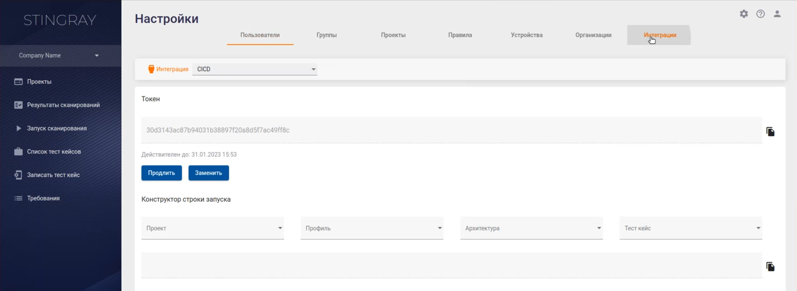
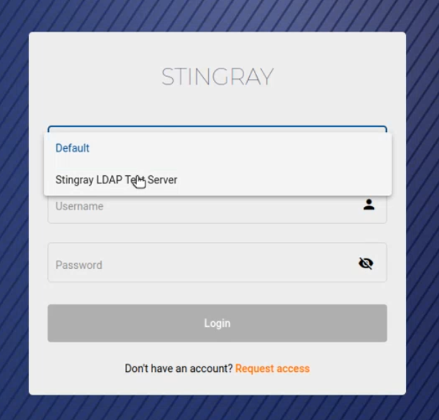

# Интеграция с LDAP

  <h3>Создание конфигурационного профиля LDAP</h3>
  
Чтобы настроить интеграцию с LDAP, выполните следующее:

  
Нажмите иконку <strong>Настройки</strong>, расположенную в правом верхнем углу пользовательского интерфейса.

  

  
Перейдите на вкладку <strong>Интеграции</strong>.

  

  
В раскрывающемся меню выберите пункт <strong>LDAP</strong>.

  

  
Для создания конфигурационного профиля нажмите на пустую карточку со знаком «+».

  

  
В открывшемся окне <strong>Добавление LDAP сервера</strong> укажите следующие параметры (все поля обязательны для заполнения):

  

  <ul class="Disc">
    <li><strong>Название</strong> — название профиля подключения к LDAP-серверу.</li>
    <li><strong>Описание</strong> — краткое описание профиля подключения к LDAP-серверу. </li>
    <li><strong>URL</strong> — адрес LDAP-сервера. </li>
    <li><strong>Base DN</strong> — атрибут, однозначно определяющий объект Distinguished Name сервера LDAP, к которому производится подключение. </li>
    <li><strong>Логин администратора</strong> — логин LDAP-пользователя, из-под которого будет производиться подключение к LDAP-серверу. </li>
    <li><strong>Пароль администратора</strong> — пароль LDAP-пользователя, из-под которого будет производиться подключение к LDAP-серверу. </li>
    <li><strong>Фильтр пользователей</strong> — параметр в формате фильтра для LDAP, определяющий, какие пользователи смогут аутентифицироваться в системе. Пользователи, которые не попадают под заданный фильтр, не смогут войти в систему.</li>
    <li><strong>Атрибут логина</strong> — атрибут записи LDAP-пользователя, который будет использоваться в качестве логина для авторизации в Stingray (возможно использование полей, по которым осуществляется логин в LDAP, например, userPrincipalName).  </li>
    <li><strong>Group DN</strong> — параметр в формате фильтра для LDAP, который идентифицирует группы (чтобы отличить их от остальных записей в LDAP).</li>
    <li><strong>Фильтр групп</strong> — параметр в формате фильтра для LDAP, определяющий, какие группы будут доступны в дальнейшем для связи с группами внутри системы Stingray.</li>
  </ul>
  
Если выбрана опция <strong>Автообновление групп</strong>, при авторизации пользователя осуществляется обновление информации о группах Stingray и LDAP.

  
После успешного создания конфигурационного профиля можно проверить соединение с LDAP-сервером, нажав на кнопку <strong>Тест</strong>. В результате успешного соединения в верхней части окна появится соответствующее сообщение.

  

  <h3>Сопоставление групп пользователей</h3>
  
Сопоставление групп пользователей позволяет при первой авторизации автоматически добавлять LDAP-пользователей, входящих в определенные группы, в соответствующие группы системы Stingray. Таким образом, сразу после входа LDAP-пользователь получает необходимый набор прав и возможностей в системе Stingray без необходимости выполнения дополнительных настроек прав доступа.

  
Чтобы выполнить сопоставление групп пользователей LDAP и Stingray, нажмите кнопку <strong>Mapping</strong> на карточке конфигурационного профиля LDAP.

  

  
В открывшемся окне <strong>Изменение LDAP сервера</strong> настройте соответствие групп пользователей. Более подробная информация о группах пользователей Stingray приведена в разделе «<a href="Polzovateli.htm#Groups">Группы пользователей</a>».

  

  
В левой колонке отображаются группы пользователей в системе Stingray, а в правой — на сервере LDAP.

  
<strong>Примечание:</strong> настройку групп пользователей необходимо выполнять последовательно (по одной), каждый раз подтверждая сделанный выбор нажатием соответствующей кнопки <strong>Сохранить</strong>. Не следует пытаться установить соответствия сразу для двух или трех пар групп, а затем нажать кнопки <strong>Сохранить</strong>.

  
При необходимости можно удалить созданное ранее сопоставление групп пользователей. Нажмите на кнопку <strong>Mapping</strong>, а затем — на кнопку <strong>Удалить</strong>, расположенную рядом с парой групп пользователей.

  
Важно заметить, что, например, пользователь с ролью Менеджер не сможет удалить сопоставление для групп пользователей с ролью Администраторы. 

  <h3>Авторизация LDAP-пользователей</h3>
  
Чтобы авторизоваться в качестве LDAP-пользователя, необходимо на странице авторизации выбрать соответствующий конфигурационный профиль LDAP, а затем ввести имя пользователя и пароль.

  

  
После авторизации пользователю предоставляются права, соответствующие группе, в которую он включен в результате сопоставления групп. См. раздел «<a href="#Сопоставление_групп_пользователей">Сопоставление групп пользователей</a>».

  
После первоначальной авторизации LDAP-пользователи отображаются на вкладке <strong>Пользователи</strong> страницы <strong>Настройки</strong>, а также в списке пользователей соответствующей группы на вкладке <strong>Группы</strong> страницы <strong>Настройки</strong>, см. раздел «<a href="Polzovateli.htm">Пользователи, группы, проекты</a>».

</body>
</html>