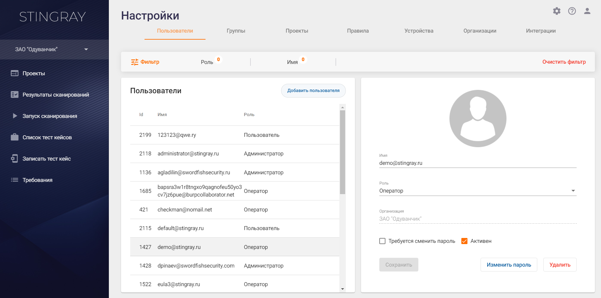

# Пользователи, группы, проекты

  <h3>Ролевая модель</h3>
  
Работу с продуктом осуществляют пользователи с различными функциональными обязанностями. В связи с этим ролевая модель системы предусматривает широкие возможности настройки и разграничения прав доступа. В целом она формируется в проекциях административных и проектных прав доступа. 

  <h4>Административные права доступа</h4>
  
Административные права доступа определяют возможные действия (привилегии) пользователя в рамках организации, например: управление пользователями, группами и устройствами, создание правил и формирование требований, изменение настроек на уровне организации и т. д. В части административных прав доступа определены четыре роли: <strong>Пользователь</strong>, <strong>Оператор</strong>, <strong>Менеджер</strong> и <strong>Администратор</strong>.

  
<strong>Примечание:</strong> каждая последующая роль включает полный набор привилегий предыдущей роли.

  
<strong>Пользователь</strong> — минимально возможные административные права в системе. Пока <strong>Пользователь</strong> не назначен на какой-либо проект, он не может выполнять какие-либо продуктивные действия в системе. После добавления в проект он получает привилегии, определяемые назначенными ему проектными правами доступа, см. раздел «<a href="#Proektnye_prava_dostupa" title="Проектные права доступа">Проектные права доступа</a>».

  
<strong>Оператор</strong> — может просматривать настройки организации (пользователи, группы, правила, требования, устройства, интеграции и т. д.) без возможности их редактирования.

  
<strong>Менеджер</strong> — может изменять настройки системы в рамках организации, за исключением создания проектов и назначения проектных ролей пользователей.

  
<strong>Администратор</strong> — отличительной особенностью этой роли являются возможность создания новых проектов и назначение проектных ролей пользователей. Администратор имеет максимально возможные права доступа в рамках административной части ролевой модели, Кроме этого, он имеет доступ ко всем проектам, даже при отсутствии соответствующей проектной роли.

  
Административные роли пользователей отображаются на вкладке <strong>Пользователи</strong> страницы <strong>Настройки</strong>.

  

  <h4>Проектные права доступа</h4>
  
Проектные права доступа, как очевидно из названия, позволяют регламентировать действия пользователя в рамках проекта (-ов), например: запуск сканирований, настройки проекта, профилей и т. д. Обычно назначение проектной роли происходит при добавлении пользователя в проект, однако предусмотрена и возможность ее изменения. Пользователь может быть добавлен в проект с одной из следующих ролей:

  
<strong>Чтение (Viewer)</strong> — доступ только на чтение. Такой пользователь может просматривать всю информацию, имеющую отношение к проекту, на который он назначен: настройки проекта и профилей, результаты сканирований, тест-кейсы, правила и требования и т. д.

  
<strong>Инженер (Engineer)</strong> — пользователь, активно работающий с системой и приложениями, как правило — разработчик или аналитик информационной безопасности. Он может запускать сканирования, работать с результатами, записывать тест-кейсы и т. д. <strong>Инженер</strong>, фактически, имеет полный доступ к проекту, за исключением возможности добавления новых пользователей, настройки интеграций со сторонними инструментами и удаления проекта. 

  
<strong>Администратор (Admin)</strong> — в дополнение к привилегиям, доступным пользователям с проектной ролью <strong>Инженер</strong>, проектный <strong>Администратор</strong> имеет возможность выполнять настройки проекта, включая настройку интеграций и добавление пользователей. Кроме этого, при необходимости он, может удалить проект.

  
<strong>Примечание:</strong> каждая последующая роль включает полный набор привилегий предыдущей роли.

  
Назначение проектных ролей пользователей осуществляется на вкладке <strong>Проекты</strong> страницы <strong>Настройки</strong>. Более подробную информацию см. в разделе «<a href="#Dobavlenie_polzovatelej_v_proekt">Добавление пользователей в проект</a>».

  <h3>Информация о пользователях</h3>
  
Нажав расположенную в правом верхнем углу иконку , перейдите в раздел <strong>Настройки</strong>. При переходе в раздел <strong>Настройки</strong> открывается первая вкладка <strong>Пользователи</strong>.

  
 

  
В левой части данной вкладки представлен полный список пользователей с кратким описанием их характеристик:

  <ul class="Disc">
    <li><strong>Id </strong>— цифровой идентификатор пользователя.</li>
    <li><strong>Имя</strong> — логин пользователя в системе (в формате адреса электронной почты).</li>
    <li><strong>Роль</strong> — административная роль пользователя.</li>
  </ul>
  
При нажатии на строку, соответствующую пользователю, в правой части вкладки появляется подробная информация о нем.

  
<strong>Администратор</strong> может совершать следующие действия: добавление, редактирование и удаление пользователей.

  <h3>Добавление пользователя</h3>
  <table style="width: 100%;border-width: 1px;border-style: none;border-color: #000000;border-left-width: 1px;border-left-style: none;border-left-color: #000000;border-top-width: 1px;border-top-style: none;border-top-color: #000000;border-right-width: 1px;border-right-style: none;border-right-color: #000000;border-bottom-width: 1px;border-bottom-style: none;border-bottom-color: #000000">
    <colgroup>
      <col style="width: 50px;"/>
      <col/>
    </colgroup>
    <tbody>
      <tr style="height: 50px;">
        <td style="text-align: center;border-width: 3px;border-style: solid;border-color: transparent;border-left-width: 3px;border-left-style: solid;border-left-color: transparent;border-top-width: 3px;border-top-style: solid;border-top-color: transparent;border-right-width: 3px;border-right-style: solid;border-right-color: transparent;border-bottom-width: 3px;border-bottom-style: solid;border-bottom-color: transparent;background-color: #0069E6">!</td>
        <td style="border-width: 3px;border-style: solid;border-color: transparent;border-left-width: 3px;border-left-style: solid;border-left-color: transparent;border-top-width: 3px;border-top-style: solid;border-top-color: transparent;border-right-width: 3px;border-right-style: solid;border-right-color: transparent;border-bottom-width: 3px;border-bottom-style: solid;border-bottom-color: transparent;background-color: rgba(0, 105, 230, 0.30);color: #003366"><strong style="color: #006699"></strong><strong>Для добавления пользователя в систему необходима административная роль Менеджера или Администратора.</strong></td>
      </tr>
    </tbody>
  </table>
  
Чтобы добавить нового пользователя в систему, находясь на вкладке <strong>Пользователи</strong>, нажмите кнопку <strong>Добавить пользователя</strong>.

  

  
Появляется диалоговое окно <strong>Добавление пользователя</strong>, в котором необходимо указать следующую информацию:

  <ul class="Disc">
    <li><strong>Имя</strong> пользователя — логин для аутентификации пользователя в системе (в формате адреса электронной почты).</li>
    <li>Дважды ввести <strong>Пароль</strong>.</li>
    <li>И выбрать административную <strong>Роль</strong> пользователя.</li>
  </ul>
  

  <h3>Редактирование профиля пользователя</h3>
  
Для редактирования профиля пользователя необходимо в левой части вкладки <strong>Пользователи</strong> нажать на соответствующую пользователю строку. В правой части вкладки отобразится подробная информация о соответствующем пользователе.

  

  
Реализована возможность изменения следующих параметров:

  <ul class="Disc">
    <li><strong>Имя</strong> пользователя (в формате адреса электронной почты).</li>
    <li>Административная <strong>Роль</strong> пользователя в системе (<strong></strong><strong>Пользователь</strong>/<strong>Оператор</strong>/<strong>Менеджер</strong>/<strong>Администратор</strong><strong></strong>).</li>
  </ul>
  
Кроме этого, в данном окне <strong>Администратор</strong> может инициировать смену пароля пользователя (при следующем входе пользователя в систему отобразится соответствующее окно), а также изменить его статус (<strong>Активен</strong>/<strong>Неактивен</strong>). Если галочка в поле <strong>Активен </strong>отсутствует, пользователь не сможет войти в систему.

  <h3>Удаление пользователя</h3>
  
Для удаления профиля пользователя необходимо нажать кнопку <strong>Удалить</strong> и подтвердить свои действия в появившемся диалоговом окне.

  <h3>Смена пароля пользователя</h3>
  
Изменение пароля пользователя производится по нажатию кнопки <strong>Изменить пароль</strong> в профиле пользователя. В появившемся окне <strong>Изменение пароля </strong>требуется ввести пароль <strong>Администратора</strong>, производящего смену пароля пользователя, и новый пароль пользователя.

  

  <h3 style="text-align: left;">Группы пользователей</h3>
  
В системе предусмотрена возможность группировки пользователей с целью повышения удобства добавления их в проект, а также облегчения разграничения прав доступа.

  
Например, можно создать группу <strong>Администраторы</strong> и добавить в нее всех пользователей, которых необходимо наделить администраторскими привилегиями.

  
<strong>Примечание:</strong> Следует отметить, что в основе ролевой модели системы лежит принцип наибольших привилегий. Проиллюстрируем его небольшим примером: если пользователь с административной ролью <strong>Оператор</strong> будет добавлен в группу <strong>Администраторов</strong>, то он будет обладать всеми правами <strong>Администратора</strong>.

  
<strong></strong><strong>Примечание:</strong> при назначении ролей пользователям важно четко понимать разницу между административными и проектными правами доступа. Кроме этого, необходимо отметить, что пользователь не может создавать группы или добавлять пользователей в группы с привилегиями выше своей роли. Например, <strong>Менеджер</strong> может создавать группы, обладающие максимум менеджерскими привилегиями, и не может добавлять/удалять пользователей в группы <strong>Администраторов</strong>.

  <h4 style="text-align: left;">Создание/удаление групп пользователей</h4>
  <table style="width: 100%;border-width: 1px;border-style: none;border-color: #000000;border-left-width: 1px;border-left-style: none;border-left-color: #000000;border-top-width: 1px;border-top-style: none;border-top-color: #000000;border-right-width: 1px;border-right-style: none;border-right-color: #000000;border-bottom-width: 1px;border-bottom-style: none;border-bottom-color: #000000">
    <colgroup>
      <col style="width: 50px;"/>
      <col/>
    </colgroup>
    <tbody>
      <tr style="height: 50px;">
        <td style="text-align: center;border-width: 3px;border-style: solid;border-color: transparent;border-left-width: 3px;border-left-style: solid;border-left-color: transparent;border-top-width: 3px;border-top-style: solid;border-top-color: transparent;border-right-width: 3px;border-right-style: solid;border-right-color: transparent;border-bottom-width: 3px;border-bottom-style: solid;border-bottom-color: transparent;background-color: #0069E6">!</td>
        <td style="border-width: 3px;border-style: solid;border-color: transparent;border-left-width: 3px;border-left-style: solid;border-left-color: transparent;border-top-width: 3px;border-top-style: solid;border-top-color: transparent;border-right-width: 3px;border-right-style: solid;border-right-color: transparent;border-bottom-width: 3px;border-bottom-style: solid;border-bottom-color: transparent;background-color: rgba(0, 105, 230, 0.30);color: #003366"><strong style="color: #006699"></strong><strong>Для создания/удаления группы пользователей необходима административная роль <strong>Администратора </strong>или <strong>Менеджера</strong>.</strong></td>
      </tr>
    </tbody>
  </table>
  
Чтобы создать группу пользователей, нажмите на иконку , расположенную в правом верхнем углу пользовательского интерфейса. Перейдите на вкладку <strong>Группы</strong> и нажмите кнопку <strong>Добавить группу</strong>. Укажите <strong>Имя</strong> и <strong>Описание</strong> группы, а также выберите соответствующую ей административную роль. Более подробную информацию об административных ролях см. выше в разделе «<a href="#Administrativnye_prava_dostupa">Административные права доступа</a>».

  

  
Удаление группы пользователей также осуществляется на вкладке <strong>Группы</strong>. Выберите нужную группу в области <strong>Группы</strong> и нажмите на кнопку <strong>Удалить</strong> в области <strong>Детали</strong>.

  <h4>Добавление/удаление пользователя из группы</h4>
  
Чтобы добавить пользователя в группу, нажмите на иконку , расположенную в правом верхнем углу пользовательского интерфейса. Перейдите на вкладку <strong>Группы</strong> и, выбрав в левой части экрана нужную группу, добавьте в нее пользователя, найдя его в поле <strong>Поиск пользователя</strong> и нажав кнопку <strong>Добавить</strong>.

  
 

  
<strong>Примечание:</strong> повторимся, что в основе ролевой модели системы лежит принцип наибольших привилегий — если пользователь с административной ролью <strong>Оператор</strong> будет добавлен в группу, для которой выбраны права <strong>Администратор</strong>, то он будет обладать всеми административными правами <strong>Администратора</strong>.

  
Чтобы удалить пользователя из группы, нажмите на иконку  в строке соответствующего пользователя.

  <h3 style="text-align: left;">Добавление пользователей (групп пользователей) в проект</h3>
  <table style="width: 100%;border-width: 1px;border-style: none;border-color: #000000;border-left-width: 1px;border-left-style: none;border-left-color: #000000;border-top-width: 1px;border-top-style: none;border-top-color: #000000;border-right-width: 1px;border-right-style: none;border-right-color: #000000;border-bottom-width: 1px;border-bottom-style: none;border-bottom-color: #000000">
    <colgroup>
      <col style="width: 50px;"/>
      <col/>
    </colgroup>
    <tbody>
      <tr style="height: 50px;">
        <td style="text-align: center;border-width: 3px;border-style: solid;border-color: transparent;border-left-width: 3px;border-left-style: solid;border-left-color: transparent;border-top-width: 3px;border-top-style: solid;border-top-color: transparent;border-right-width: 3px;border-right-style: solid;border-right-color: transparent;border-bottom-width: 3px;border-bottom-style: solid;border-bottom-color: transparent;background-color: #0069E6">!</td>
        <td style="border-width: 3px;border-style: solid;border-color: transparent;border-left-width: 3px;border-left-style: solid;border-left-color: transparent;border-top-width: 3px;border-top-style: solid;border-top-color: transparent;border-right-width: 3px;border-right-style: solid;border-right-color: transparent;border-bottom-width: 3px;border-bottom-style: solid;border-bottom-color: transparent;background-color: rgba(0, 105, 230, 0.30);color: #003366"><strong style="color: #006699"></strong><strong>Для добавления пользователя (группы пользователей) в проект необходима проектная или административная роль Администратор. Более подробную информацию о проектных ролях пользователей см. в разделе «<a href="#Proektnye_prava_dostupa" title="Проектные права доступа">Проектные права доступа</a>».</strong></td>
      </tr>
    </tbody>
  </table>
  
Чтобы добавить пользователя (группу пользователей) в проект, нажмите на иконку , расположенную в правом верхнем углу пользовательского интерфейса и перейдите на вкладку <strong>Проекты</strong>.

  

  
Выберите необходимый проект из списка в левой части экрана (область <strong>Проекты</strong>), найдите нужного пользователя (или группу пользователей) в поле <strong>Поиск пользователя или группы</strong> и назначьте ему необходимую проектную роль, выбрав необходимое значение в раскрывающемся списке <strong>Роль</strong>. В завершении нажмите кнопку <strong>Добавить</strong>. Более подробная информация о группах пользователей приведена в разделе «<a href="#Groups">Группы пользователей</a>».

  
Список пользователей, добавленных в проект можно просмотреть в области <strong>Детали</strong> вкладки <strong>Проекты</strong>.

  
<strong>Примечание:</strong> при назначении ролей пользователям важно четко понимать разницу между административными и проектными правами доступа. Кроме этого, необходимо отметить, что пользователь не может создавать группы или добавлять пользователей в группы с привилегиями выше своей роли. Например, <strong>Менеджер</strong> может создавать группы, обладающие максимум менеджерскими привилегиями, и не может добавлять/удалять пользователей в группы <strong>Администраторов</strong>.

  
 

  
 

</body></html>