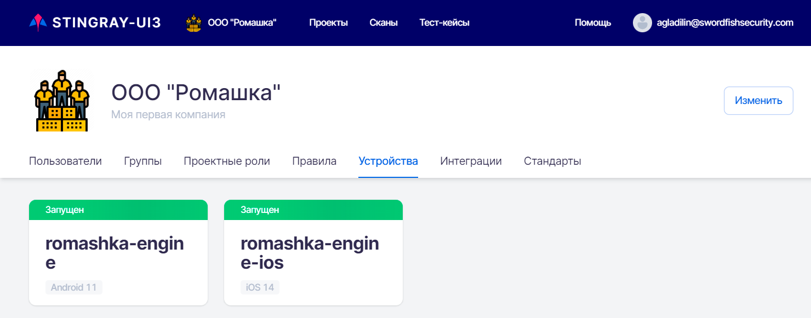

# Устройства

Для просмотра списка устройств Компании необходимо в левом верхнем углу нажать название компании, а далее на странице настроек  выбрать вкладку **Устройства**.

<figure markdown>

</figure>
 
На данной вкладке представлены относящиеся к Компании устройства, которые можно использовать для проведения сканирования приложений. Например, если у Компании существует два устройства, как на рисунке выше, то возможен запуск двух сканирований одновременно. В случае, если для запуска на сканирование будет выбран третий тест, для начала его выполнения придется дождаться окончания одного из двух запущенных тестов и освобождения одного из двух устройств.

Каждое устройство представлено на странице отдельной карточкой со следующей информацией:

* Имя устройства в системе.
* Архитектура — операционная система устройства.
* Статус устройства отображает состояние устройства (**Запущен**, **Запускается**, **Остановлен** или **Не существует**).