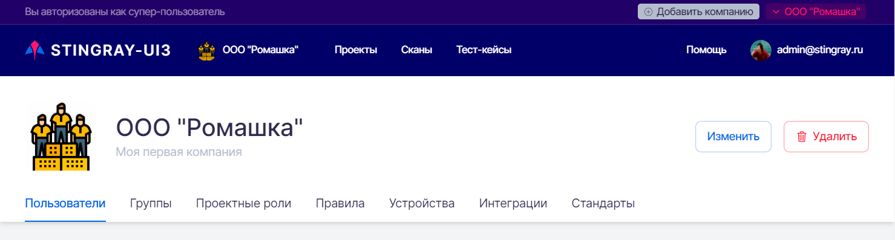

# Компании

!!! note "Примечание"
    Работать в системе со всеми Компаниями может только пользователь с правами Супер администратора.

Для каждой организации в системе создается своя Компания. Все сотрудники одной организации работают в системе в одной Компании. В ней они получают административные права доступа и роли (подробное описание прав доступа и ролей приведено в разделе «[Административные права доступа](../polzovateli/#_3)». Все сотрудники компании не имеют в системе доступа к данным прочих Компаний, таким как пользователи, проекты, профили, правила, тест-кейсы, стандарты, требования, собранные данные, дефекты, эмуляторы и т. п. Каждая Компания имеет в системе свое выделенное пространство и не знает о существовании других Компаний.

Работать в системе со всеми Компаниями может только пользователь с правами Супер администратора. Эта роль необходима, в частности, для создания, изменения или удаления Компаний.

Компанию, зарегистрированную в системе, можно выбрать из списка в правом верхнем углу пользовательского интерфейса:

<figure markdown>

</figure>

## Добавление Компании

Чтобы создать новую Компанию, нажмите на кнопку **Добавить** компанию в правой верхней части экрана:

<figure markdown>

</figure>
 
В появившемся окне введите название Компании и ее краткое описание:

<figure markdown>

</figure>
 
Вновь созданная Компания появится в списке Компаний, доступных для выбора в правом верхнем углу пользовательского интерфейса. При создании Компания получает набор стандартов по умолчанию и набор правил по умолчанию, которые могут быть модифицированы в дальнейшем в ходе работы, а также действующий токен CI/CD.

## Изменение Компании

При нажатии названия Компании в левом вернем углу пользовательского интерфейса открывается страница настроек Компании. Для редактирования Компании нажмите кнопку **Изменить**:

<figure markdown>

</figure>
 
В появившемся окне можно изменить название Компании и ее краткое описание.
 
## Удаление Компании

Удаление существующей Компании производится на странице настроек Компании по нажатию кнопки **Удалить**. Это действие необходимо подтвердить в появившемся диалоговом окне:

<figure markdown>

</figure>