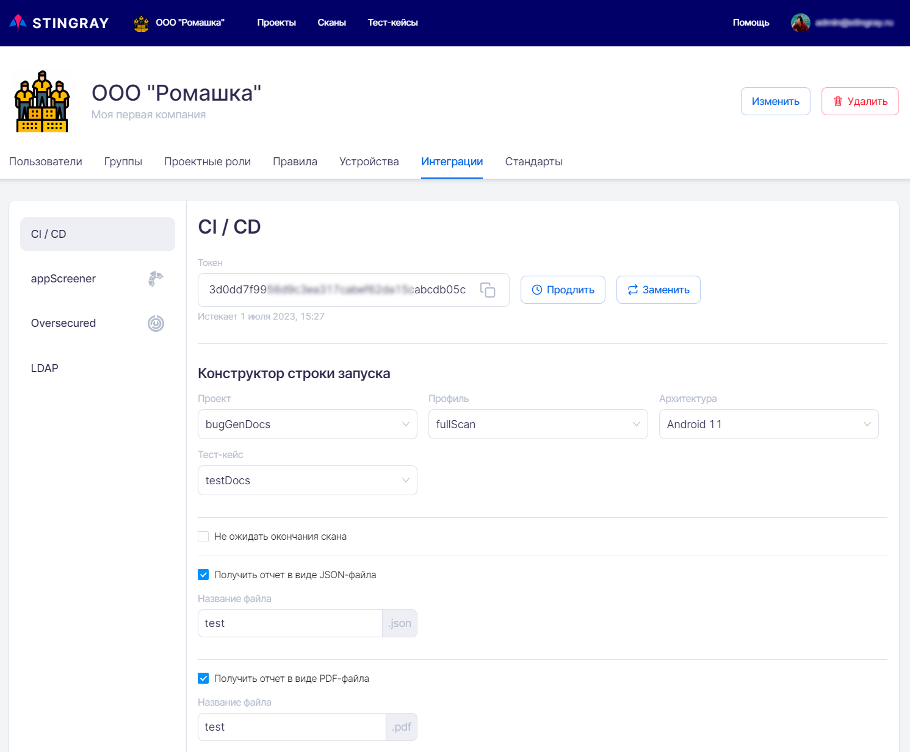
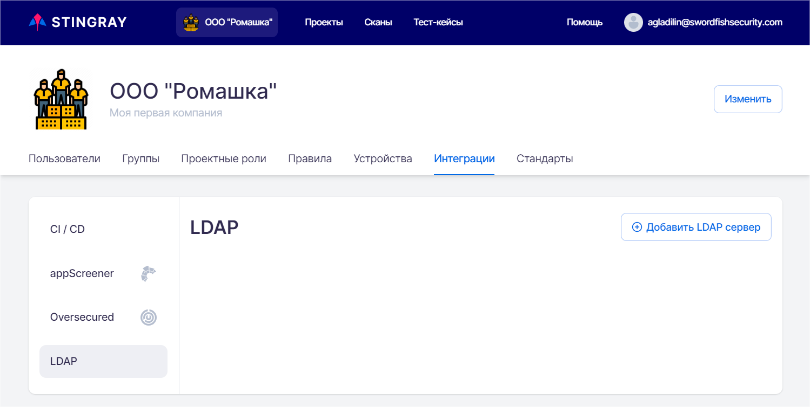
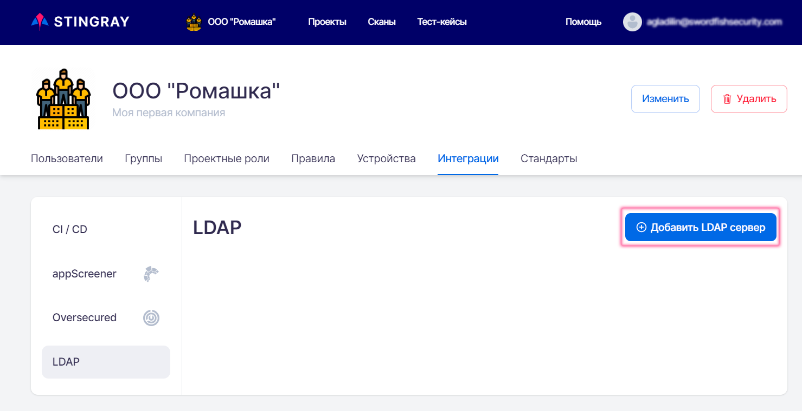
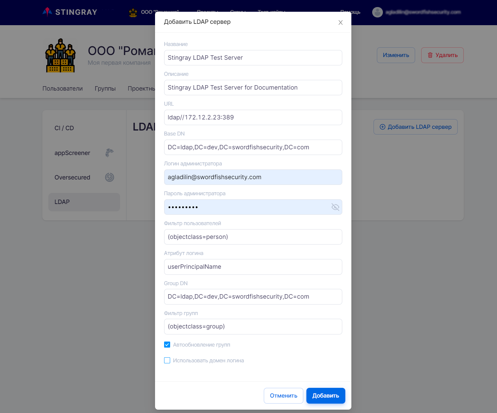
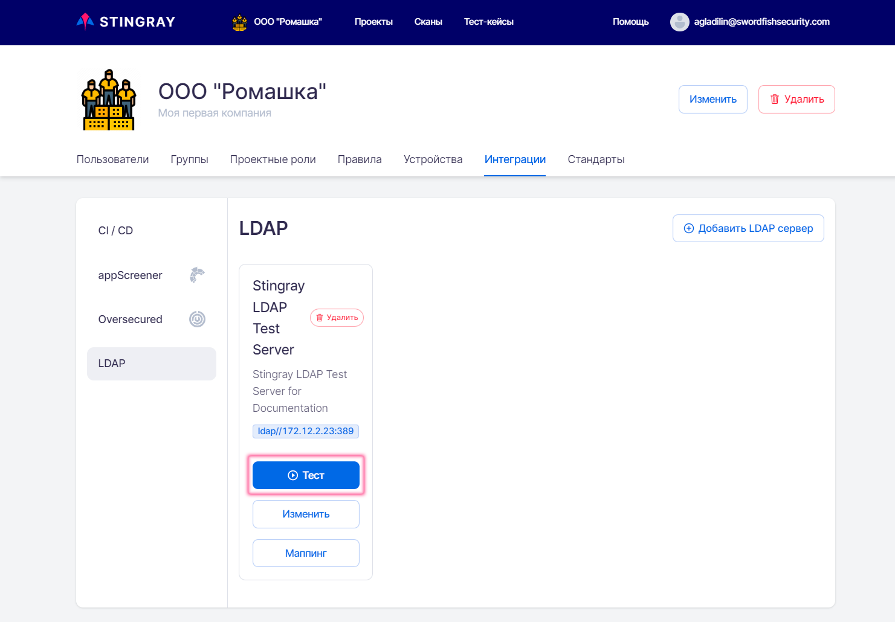
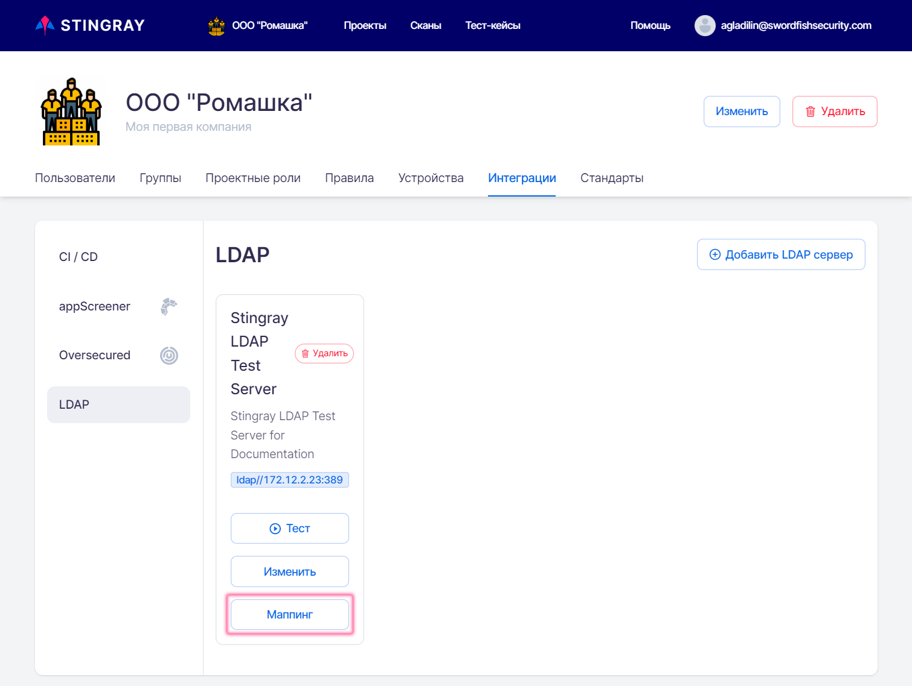

# Интеграции

Для настройки интеграции с различными инструментами необходимо в левом верхнем углу нажать название Компании, а далее на странице настроек выбрать вкладку **Интеграции**.

<figure markdown>

</figure>
 
Меню в левой части вкладки **Интеграции**  позволяет переключаться между настройками инструментов.

## CI/CD

Выберите в расположенном слева меню пункт **CI/CD** — здесь представлены следующие поля:

* **Токен** — интерфейс для получения токена интеграции в процесс разработки.
* **Конструктор строки запуска** — конструктор для получения строки запуска в зависимости от типа выбранных параметров.

Действующий токен CI/CD может быть использован в качестве аутентификационных данных и позволяет не авторизоваться и не проходить аутентификацию вручную каждый раз при запуске сканирования приложения. Время жизни такого токена — один год. Таким образом, появляется возможность работы через CLI или через систему дистрибуции.

### Управление токенами CI/CD

Доступ в раздел настройки имеют только пользователи с административными правами Администратора или Менеджера.

Работу по тестированию приложений могут производить пользователи с проектными правами Администратора или Инженера.

Для эффективной работы внутри Компании пользователь с административными правами Администратора или Менеджера может брать корректный токен в настройках системы в разделе **CI/CD** и раздавать другим пользователям для проведения сканирования приложения и анализа результатов.

С помощью токена можно получить доступ к информации об архитектурах, сканирующих агентах, тест-кейсах, сканированиях (общая информация и скачивание отчета), а также осуществлять запуск сканирований. При этом возможно только получение информации, но не ее изменение.

Время жизни токена — один год. Администратор или Менеджер должен отслеживать процесс перевыпуска и обеспечивать других пользователей корректными CI/CD токенами.

Для работы с токеном на вкладке предусмотрены следующие действия с помощью кнопок в левой части экрана:

* **Продлить** — продлевает время жизни текущего токена на один год и не изменяет его.

* **Заменить** — заменяет значение токена (старый токен при этом инвалидируется).

### Формирование команды запуска для CLI

Как было сказано выше в разделе «[Запуск сканирования](../ug/zapusk_skanirovaniya.md)», сканирование приложения можно запустить не только из пользовательского интерфейса системы, но также из командной строки. Запуск сканирования из командной строки можно производить только имея валидный токен CI/CD.

Процесс формирования командной строки включает следующие шаги:

* В параметрах формы **Конструктор строки запуска** выбрать необходимые значения для запуска:
    * Проект.
    * Профиль.
    * Архитектура.
    * Тест-кейс.
    * Вариант запуска. 
    * Система дистрибьюции.
    * Путь файлу.
    * Ряд опций работы (**Не ожидать окончания скана**, **Получить отчет в виде JSON-файла**, **Получить отчет в виде PDF-файла**).
* В зависимости от выбранных значений, могут появиться дополнительные параметры запуска, которые также необходимо заполнить.
* Будет сформирована строка запуска, в которой необходимо заменить месторасположение файла.

Сформированную таким образом командную строку можно использовать при работе через CLI.

## AppScreener

Выберите в расположенном слева меню пункт **AppScreener**. Для интеграции с AppScreener понадобится токен, порядок создания которого подробно описан в разделе «[Интеграция с AppScreener](./integraciya_s_appscreener.md)» Руководства по установке и интеграции.

Переведите селектор, расположенный справа, в положение «включено».

Вставьте полученный токен для интеграции в соответствующее поле.

<figure markdown>

</figure>

!!! note "Примечание"
    **URL** задается при установке системы и не может быть изменен **Пользователем** или **Администратором** системы.

Нажмите кнопку **Тест**, чтобы проверить соединение с инструментом. В случае успешного соединения в левом нижнем углу пользовательского интерфейса появится соответствующее сообщение, в противном случае отобразится предупреждение об ошибке.

В нижней части страницы располагается таблица, позволяющая задать соответствия между проектами Stingray и AppScreener. Для настройки используйте раскрывающиеся меню.

<figure markdown>

</figure>

Для завершения настройки интеграции необходимо перейти в профиль выбранного проекта и на вкладке **Модули** активировать соответствующий модуль, см. раздел «[Профили](../ug/profile.md)».

<figure markdown>

</figure>

!!! note "Примечание"
    Если в ходе настройки интеграции с инструментом не были заданы соответствия проектов Stingray и AppScreener, то при первом запуске сканирования в AppScreener будет создан проект, название которого будет сформировано по следующей маске:
    <figure markdown>
    *Название компании_название проекта*
    </figure>

Все последующие сканирования в выбранном проекте Stingray будут выполняться в созданном проекте AppScreener при условии, что в профиле проекта Stingray включена соответствующая интеграция.

## Oversecured

Выберите в расположенном слева меню пункт Oversecured. Для интеграции с Oversecured понадобится токен, порядок создания которого подробно описан в разделе «[Интеграция с Oversecured](./integraciya_s_oversecured.md)» Руководства по установке и интеграции.

Дальнейшая настройка интеграции с Oversecured выполняется аналогично интеграции с AppScreener, описанной выше в разделе «[AppScreener](./integracii.md#appscreener)».

## LDAP

### Создание конфигурационного профиля LDAP

Перейдя на страницу настройки компании, выберите вкладку **Интеграции** и перейдите в раздел **LDAP**.

<figure markdown>

</figure>

Чтобы добавить новый LDAP сервер, нажмите на соответствующую кнопку в правой части пользовательского интерфейса.

<figure markdown>

</figure>

В открывшемся окне **Добавить LDAP сервер** укажите следующие параметры (все поля обязательны для заполнения):

<figure markdown>

</figure>

* **Название** — название профиля подключения к LDAP-серверу.
* **Описание** — краткое описание профиля подключения к LDAP-серверу. 
* **URL** — адрес LDAP-сервера. 
* **Base DN** — атрибут, однозначно определяющий объект Distinguished Name сервера LDAP, к которому производится подключение. 
* **Логин администратора** — логин LDAP-пользователя, из-под которого будет производиться подключение к LDAP-серверу. 
* **Пароль администратора** — пароль LDAP-пользователя, из-под которого будет производиться подключение к LDAP-серверу. 
* **Фильтр пользователей** — параметр в формате фильтра для LDAP, определяющий, какие пользователи смогут аутентифицироваться в системе. Пользователи, которые не попадают под заданный фильтр, не смогут войти в систему.
* **Атрибут логина** — атрибут записи LDAP-пользователя, который будет использоваться в качестве логина для авторизации в Stingray (возможно использование полей, по которым осуществляется логин в LDAP, например, userPrincipalName).  
* **Group DN** — параметр в формате фильтра для LDAP, который идентифицирует группы (чтобы отличить их от остальных записей в LDAP).
* **Фильтр групп** — параметр в формате фильтра для LDAP, определяющий, какие группы будут доступны в дальнейшем для связи с группами внутри системы Stingray.

Если выбрана опция **Автообновление групп**, при авторизации пользователя осуществляется обновление информации о группах Stingray и LDAP.

Если выбрана опция **Использовать домен логина** и в появившемся поле указан соответствующий домен (например, `stingray.ourcompany.com`), то при последующей авторизации пользователи могут не указывать адрес электронной почты полностью (`myname@stingray.ourcompany.com`), а ограничиться логином (`myname`).

После успешного создания конфигурационного профиля можно проверить соединение с LDAP-сервером, нажав на кнопку **Тест**. В результате успешного соединения в левом нижнем углу пользовательского интерфейса появится соответствующее сообщение.

<figure markdown>

</figure>

### Сопоставление групп пользователей

Сопоставление групп пользователей позволяет при первой авторизации автоматически добавлять LDAP-пользователей, входящих в определенные группы, в соответствующие группы системы Stingray. Таким образом, сразу после входа LDAP-пользователь получает необходимый набор прав и возможностей в системе Stingray без необходимости выполнения дополнительных настроек прав доступа.

Чтобы выполнить сопоставление групп пользователей LDAP и Stingray, нажмите кнопку **Маппинг** на карточке конфигурационного профиля LDAP.

<figure markdown>

</figure>

В открывшемся окне **Маппинг** настройте соответствие групп пользователей. Более подробная информация о группах пользователей Stingray приведена в разделе «[Группы пользователей](../polzovateli/#_10)».

<figure markdown>

</figure>

В левой колонке отображаются группы пользователей в системе Stingray, а в правой — на сервере LDAP.

!!! note "Примечание"
    Настройку групп пользователей необходимо выполнять последовательно (по одной), каждый раз подтверждая сделанный выбор нажатием соответствующей кнопки **Сохранить**. Не следует пытаться установить соответствия сразу для двух пар групп, а затем нажать кнопки **Сохранить**.

При необходимости можно удалить созданное ранее сопоставление групп пользователей. Нажмите на кнопку **Маппинг**, а затем — на кнопку **Удалить**, расположенную рядом с парой групп пользователей.

Важно заметить, что, например, пользователь с ролью Менеджер не сможет удалить сопоставление для групп пользователей с ролью Администраторы. 

### Авторизация LDAP-пользователей

Чтобы авторизоваться в качестве LDAP-пользователя, необходимо на странице авторизации выбрать соответствующий конфигурационный профиль LDAP, а затем ввести имя пользователя и пароль.

<figure markdown>

</figure>

После авторизации пользователю предоставляются права, соответствующие группе, в которую он включен в результате сопоставления групп. См. раздел «[Сопоставление групп пользователей](./integracii.md#_2)».

После первоначальной авторизации LDAP-пользователи отображаются на вкладке **Пользователи** страницы настроек компании, а также в списке пользователей соответствующей группы на вкладке **Группы**, см. раздел «[Пользователи, группы, проекты](./polzovateli.md)» Руководства пользователя.