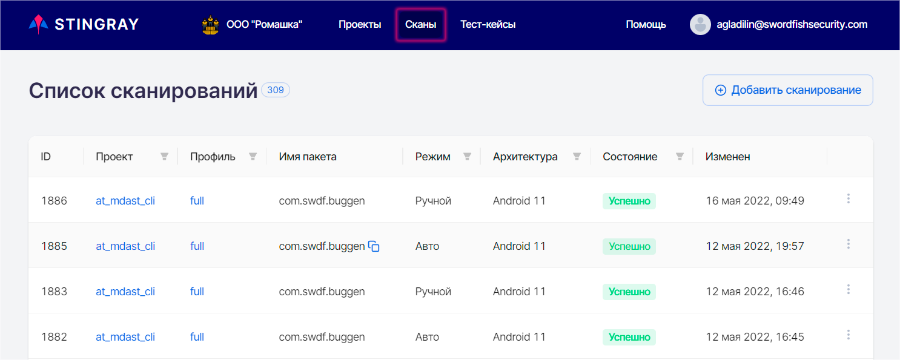
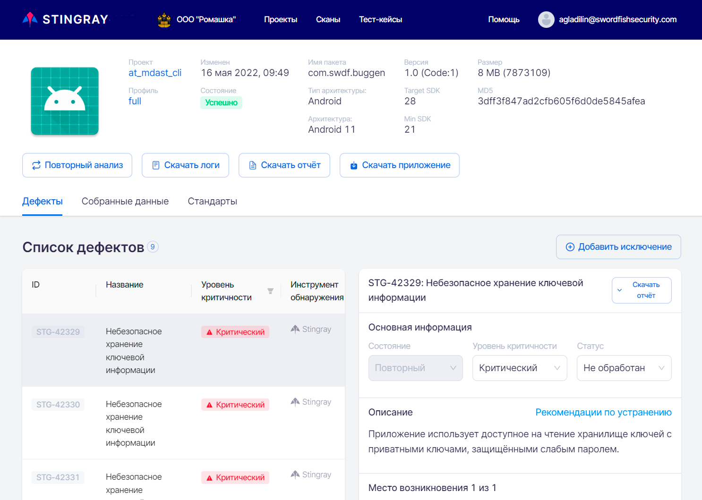
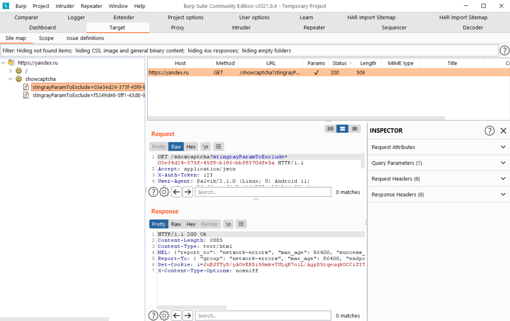

# Интеграция c Burp Suite

Stingray обеспечивает возможность передачи данных в различные инструменты анализа защищенности приложений, включая очень популярный и универсальный — [Burp Suite](https://portswigger.net/burp). Такая интеграция призвана облегчить более тщательный анализ результатов сканирования. 

## Получение результатов работы модуля Сетевая активность

Чтобы передать собранные в результате сканирования данные в Burp Suite, необходимо перейти на страницу **Сканы**.

<figure markdown>

</figure>

Нажав на **ID** соответствующего сканирования, перейти на страницу с результатами.

<figure markdown>

</figure>

Перейти на вкладку **Собранные данные** и выберите модуль **Сетевая активность**.

<figure markdown>

</figure>

Нажмите кнопку **Скачать данные модуля**, чтобы скачать zip-архив с результатами работы модуля.

<figure markdown>

</figure>

Скачанный архив содержит три файла в различных форматах.

## Импорт данных в Burp Suite

Для импорта данных в Burp Suite необходимо использовать специальный плагин [burp-har-loader](https://github.com/Dynamic-Mobile-Security/burp-har-importer).

Скачайте плагин и запустите Burp Suite.

Перейдите на страницу **Extender**.

<figure markdown>

</figure>

Нажав кнопку **Add**, откройте окно добавления плагина в Burp Suite.

В поле **Extension file (.jar)** укажите файл плагина.

Нажмите кнопку **Next**, чтобы перейти в следующее диалоговое окно.

<figure markdown>

</figure>

Убедившись, что в следующем окне отображается необходимый плагин, нажмите кнопку **Close**.

<figure markdown>

</figure>

В результате успешного добавления плагина в строке меню Burp Suite появится новый пункт **HAR Import Sitemap**.

<figure markdown>

</figure>

Нажав пункт меню **HAR Import Sitemap**, переходим на страницу плагина. Реализована возможность импорта данных в двух форматах: csv и har. Процесс экспорта данных из Stingray подробно описан выше в разделе «[Получение результатов работы модуля Сетевая активность](../integraciya_c_burp_suite/#_1)».

Выполнив импорт в удобном формате, можно перейти на вкладку **Target**, где теперь импортированы в Sitemap все запросы, которые были собраны во время работы приложения. Таким образом, можно запустить автоматическое сканирование или проанализировать вручную.

<figure markdown>

</figure>