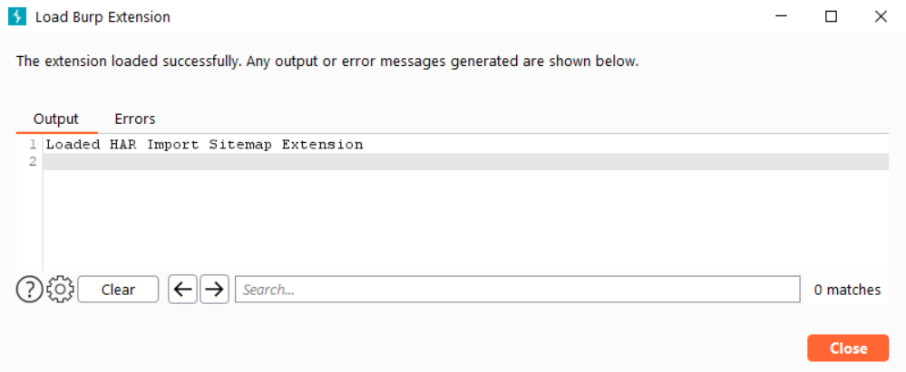

# Интеграция c Burp Suite

Stingray обеспечивает возможность передачи данных в различные инструменты анализа защищенности приложений, включая очень популярный и универсальный — [Burp Suite](https://portswigger.net/burp). Такая интеграция призвана облегчить более тщательный анализ результатов сканирования. 

## Получение результатов работы модуля Сетевая активность

Чтобы передать собранные в результате сканирования данные в Burp Suite, необходимо перейти на страницу **Результаты сканирований**.

<figure markdown>

</figure>

Нажав на строку соответствующего сканирования, перейти на страницу **Результат сканирования**.

<figure markdown>

</figure>

Перейти на вкладку **Собранные данные** и, используя расположенное в левом верхнем углу раскрывающееся меню, выбрать модуль **Сетевая активность**.

<figure markdown>

</figure>

Нажмите кнопку **Загрузить данные модуля**, чтобы скачать zip-архив с результатами сканирования выбранного модуля.

<figure markdown>

</figure>

Скачанный архив содержит три файла в различных форматах.

## Импорт данных в Burp Suite

Для импорта данных в Burp Suite необходимо использовать специальный плагин [burp-har-loader](https://github.com/Dynamic-Mobile-Security/burp-har-importer).

Скачайте плагин и запустите Burp Suite.

Перейдите на страницу **Extender**.

<figure markdown>

</figure>

Нажав кнопку **Add**, откройте окно добавления плагина в Burp Suite.

В поле **Extension file (.jar)** укажите файл плагина.

Нажмите кнопку **Next**, чтобы перейти в следующее диалоговое окно.

<figure markdown>

</figure>

Убедившись, что в следующем окне отображается необходимый плагин, нажмите кнопку **Close**.

<figure markdown>

</figure>

В результате успешного добавления плагина в строке меню Burp Suite появится новый пункт **HAR Import Sitemap**.

<figure markdown>

</figure>

Нажав пункт меню **HAR Import Sitemap**, переходим на страницу плагина. Реализована возможность импорта данных в двух форматах: csv и har. Процесс экспорта данных из Stingray подробно описан выше в разделе «[Получение результатов работы модуля Сетевая активность](https://help.stingray-mobile.ru/mergedProjects/aag/integraciya_c_burp_suite.htm#%D0%9F%D0%BE%D0%BB%D1%83%D1%87%D0%B5%D0%BD%D0%B8%D0%B5_%D1%80%D0%B5%D0%B7%D1%83%D0%BB%D1%8C%D1%82%D0%B0%D1%82%D0%BE%D0%B2_%D1%80%D0%B0%D0%B1%D0%BE%D1%82%D1%8B_%D0%BC%D0%BE%D0%B4%D1%83%D0%BB%D1%8F_%D0%A1%D0%B5%D1%82%D0%B5%D0%B2%D0%B0%D1%8F_%D0%B0%D0%BA%D1%82%D0%B8%D0%B2%D0%BD%D0%BE%D1%81%D1%82%D1%8C)».

Выполнив импорт в удобном формате, можно перейти на вкладку **Target**, где теперь импортированы в Sitemap все запросы, которые были собраны во время работы приложения. Таким образом, можно запустить автоматическое сканирование или проанализировать вручную.

<figure markdown>

</figure>