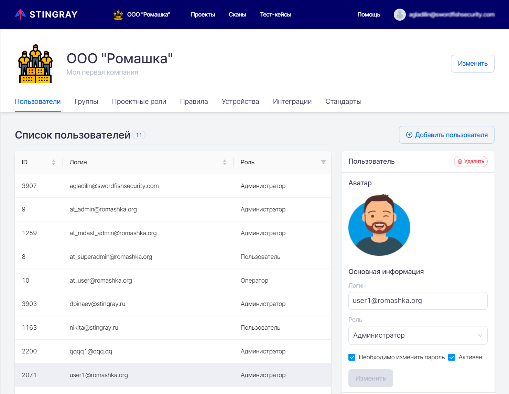

# Настройки Компании

!!! note "Примечание"
    Все настройки системы, описанные в данном разделе, может производить только пользователь с правами Администратора или Супер администратора. Работать в системе со всеми Компаниями может только пользователь с правами Супер администратора.

Для перехода на вкладку настроек Компании необходимо в левом верхнем углу нажать название компании. Настройки Компании доступны только пользователям с правами **Администратора**.

<figure markdown>

</figure>
  
На странице настроек доступны несколько вкладок: **Пользователи**, **Группы**, **Проектные роли**, **Правила**, **Устройства**, **Интеграции**, **Стандарты**.
  
<figure markdown>

</figure>