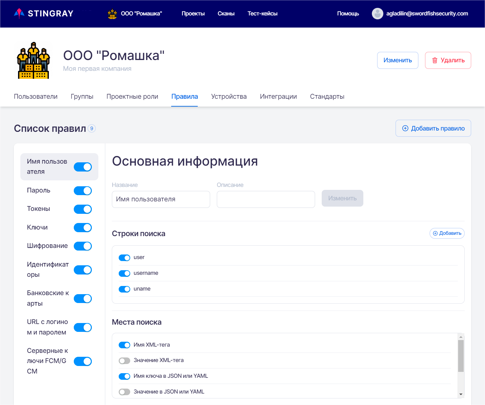

# Правила анализа на уровне Компании

Для перехода на вкладку **Правила** необходимо в левом верхнем углу нажать название компании, а далее на странице настроек выбрать соответствующую вкладку.

<figure markdown>

</figure>

На данной вкладке представлены правила анализа собранных данных для поиска уязвимостей. На этой вкладке возможно добавить, изменить или удалить существующее правило анализа на уровне Компании. То есть, новое или измененное правило будет применяться в рамках всех проектов данной Компании.

Принципы работы с правилами анализа на уровне Компании и на уровне проекта не отличаются друг от друга. В отличие от правил на уровне проекта правила на уровне компании разделены по типу архитектуры (Android/iOS). Правила для каждого типа архитектуры можно выбрать и настроить отдельно.

Описание работы правил, а также их добавление, редактирование и удаление на уровне проекта приведено в разделе «[Правила](../ug/pravila.md)».