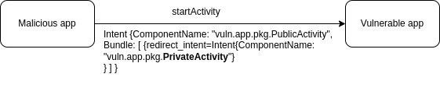

# Возможность опосредованного запуска приватных Activity

<table class='noborder'>
    <colgroup>
      <col/>
      <col/>
    </colgroup>
    <tbody>
      <tr>
        <td rowspan="2"></td>
        <td>Критичность:<strong> СРЕДНЯЯ</strong></td>
      </tr>
      <tr>
        <td>Способ обнаружения:<strong> IAST</strong></td>
      </tr>
    </tbody>
</table>

## Описание

Уязвимость позволяет запускать внутренние **неэкспортируемые Activity** приложения. Это может повлечь за собой достаточно широкий спектр проблем, начиная обходом аутентификации и заканчивая компрометацией пользовательских данных.

Уязвимость присутствует в приложениях, которые используют **Intent** из недоверенного источника (например, полученные из стороннего приложения с помощью методов `getIntent`, `getParcelableExtra` или `onActivityResult`) для запуска (`startActivity`, `startActivityForResult`) своих внутренних Activity (в дальнейшем будет использован термин «**to-be-redirected Intent**», то есть тот Intent, который получен из недоверенного источника и далее используется для запуска **Activity**).

Например, вредоносное приложение может использовать такой код:

    Intent intent = new Intent("vuln.app.pkg.LOGIN");
    Intent redirIntent = new Intent();
    redirIntent.setComponent(new ComponentName("vuln.app.pkg", "vuln.app.pkg.PrivateActivity"));
    intent.putExtra("redirect_intent", redirIntent);
    startActivity(intent);

**Целевое приложение:**

    Intent redirectIntent = getIntent().getParcelableExtra("redirect_intent");
    if(redirectIntent != null) {
        startActivity(redirectIntent);
        }
        else {
        startActivity(new Intent(this, MainActivity.class));
        }
        finish();

В результате вызова такого кода из вредоносного приложения будет запущена внутренняя Activity уязвимого приложения (**vuln.app.pkg.PrivateActivity**)

<figure markdown>

</figure>

## Рекомендации

Для устранения подобных проблем в приложении необходимо убедиться в соответствии нескольким правилам:

1. Реализовать private/in-house видимость у компонентов, которые принимают «**to-be-redirected Intent**» и используют его для последующего запуска **private/in-house Activity**. 

    Например, объявление **Activity** внутренней — отсутствуют `intent-filter` или флаг `exported` выставлен в значение `false`:

        <?xml version="1.0" encoding="utf-8"?>
        <manifest xmlns:android="http://schemas.android.com/apk/res/android"
                package="com.swordfishsecurity.appsec.android.activity.privateactivity" >
                <application
                    android:allowBackup="false"
                    android:icon="@drawable/ic_launcher"
                    android:label="@string/app_name" >
                    <!-- Private activity -->
                    <!-- *** 1 *** Не используйте taskAffinity -->
                    <!-- *** 2 *** Не используйте launchMode -->
                    <!-- *** 3 *** Явно указывайте атрибут exported="false" -->
                    <activity
                        android:name=".PrivateActivity"
                        android:label="@string/app_name"
                        android:exported="false" />
                    <!-- Public activity запускаемая по умолчанию -->
                    <activity
                        android:name=".PrivateUserActivity"
                        android:label="@string/app_name"
                        android:exported="true" >
                        <intent-filter>
                            <action android:name="android.intent.action.MAIN" />
                            <category android:name="android.intent.category.LAUNCHER" />
                        </intent-filter>
                    </activity>
                </application>
        </manifest>

2. Проводить валидацию «**to-be-redirected Intent**» на предмет вредоносности — он не должен направляться в **private/in-house Activity**

        Intent intent = getIntent();
        Intent redirectIntent = (Intent) intent.getParcelableExtra(“redirect_intent”);
        ComponentName name = redirectIntent.resolveActivity(getPackageManager());
        // проверяем целевое имя пакета и класса
        if(name.getPackageName().equals(“safe_package”) && name.getClassName().equals(“safe_class”)) {
            startActivity(redirectIntent);
        }

### Partner Activity

Еще одним способом является работа с приложениями-партнёрами. Они представляют собой приложения, которые используются сотрудничающими компаниями, которые хотят безопасно обмениваться информацией и функциональностью.

В рамках такого обмена вводится понятие **Partner Activity**. Это **Activity**, которая может совместно использоваться только из приложений, которые разработаны компаниями-партнёрами. 

Существует риск, что стороннее приложение прочитает содержимое Intent, используемого для старта **Activity**. Поэтому нужно быть уверенным, что если в **Intent**, используемый для запуска **Activity**, включается чувствительная информация, то предприняты защитные меры, которые не позволят получить к ней доступ вредоносному приложению.

#### Создание Partner Activity

При создании **Partner Activity** необходимо придерживаться нескольких правил:

1. Не используйте `taskAffinity`.
2. Не используйте `launchMode`.
3. Не объявляйте `intent-filter` и явно указывайте атрибут `exported="true"`.
4. Проверяйте, что сертификат вызывающего приложения содержится в списке сертификатов доверенных приложений.
5. Проводите проверку и безопасную обработку полученного **Intent**, несмотря на то, что он был получен из того же приложения-партнёра.
6. Возвращайте только ту информацию, к которой приложение-партнёр имеет право получить доступ.

Для реализации пункта 4 необходимо организовать получение отпечатка сертификатов доверенных приложений и их регистрацию в нашем приложении. Для этого можно воспользоваться следующими примерами кода с детальными комментариями.

**AndroidManifest.xml**

    <?xml version="1.0" encoding="utf-8"?>
    <manifest xmlns:android="http://schemas.android.com/apk/res/android"
        package="com.swordfishsecurity.appsec.android.activity.partneractivity" >
        
        <application
                android:allowBackup="false"
                android:icon="@drawable/ic_launcher"
                android:label="@string/app_name" >
                <!-- Partner activity -->
                <!-- *** 1 *** Не используйте taskAffinity -->
                <!-- *** 2 *** Не используйте launchMode -->
                <!-- *** 3 *** Не обьявляйте intent фильтры и явно указывайте атрибут exported="true" -->
                <activity
                    android:name=".PartnerActivity"
                    android:exported="true" />
        </application>
    </manifest>

**PartnerActivity.java**

    package com.swordfishsecurity.appsec.android.activity.partneractivity;
    import com.swordfishsecurity.appsec.android.shared.PkgCertWhitelists;
    import com.swordfishsecurity.appsec.android.shared.Utils;
    import android.app.Activity;
    import android.content.Context;
    import android.content.Intent;
    import android.os.Bundle;
    import android.view.View;
    import android.widget.Toast;
    public class PartnerActivity extends Activity {
        // *** 4 *** Проверяйте, что сертификат вызывающего приложения содержится в списке сертификатов доверенных приложений
        private static PkgCertWhitelists sWhitelists = null;
        private static void buildWhitelists(Context context) {
            boolean isdebug = Utils.isDebuggable(context);
            sWhitelists = new PkgCertWhitelists();
            
            // Регистрация хеша сертификата приложения-партнёра com.swordfishsecurity.appsec.android.activity.partneruser
            sWhitelists.add("com.swordfishsecurity.appsec.android.activity.partneruser", isdebug ?
                    // Хеш сертификата ключа "androiddebugkey" из debug.keystore.
                    "0EFB7236 328348A9 89718BAD DF57F544 D5CCB4AE B9DB34BC 1E29DD26 F77C8255" :
                    // Хеш сертификата ключа приложения-партнёра com.swordfishsecurity.appsec.android.activity.partneruser
                    "1F039BB5 7861C27A 3916C778 8E78CE00 690B3974 3EB8259F E2627B8D 4C0EC35A");
        
            // Регистрация других приложений-партнёров осуществляется аналогично
        }
        private static boolean checkPartner(Context context, String pkgname) {
            if (sWhitelists == null) buildWhitelists(context);
            return sWhitelists.test(context, pkgname);
        }
        
        @Override
        public void onCreate(Bundle savedInstanceState) {
            super.onCreate(savedInstanceState);
            setContentView(R.layout.main);
                
            // *** 4 *** Проверяйте, что сертификат вызывающего приложения содержится в списке сертификатов доверенных приложений
            if (!checkPartner(this, getCallingActivity().getPackageName())) {
                Toast.makeText(this,
                        "Вызывающее приложение не является партнёром",
                        Toast.LENGTH_LONG).show();
                finish();
                return;
            }
            
            // *** 5 *** Проводите проверку и безопасную обработку полученного Intent, несмотря на то, что он был получен из того же приложения-партнёра
            // См.п. "Безопасная обработка входных данных"
            
            Toast.makeText(this, "Запущено из приложения-партнёра", Toast.LENGTH_LONG).show();
        }
        public void onReturnResultClick(View view) {
            // *** 6 *** Возвращайте только ту информацию, к которой приложение-партнёр имеет право получить доступ, не больше
            Intent intent = new Intent();
            intent.putExtra("RESULT", "Информация для приложения-партнёра");
            setResult(RESULT_OK, intent);
            finish();
        }
    }

**PkgCertWhitelist.java**

    package com.swordfishsecurity.appsec.android.shared;
    import java.util.HashMap;
    import java.util.Map;
    import android.content.Context;
    public class PkgCertWhitelists {
            private Map<String, String> mWhitelists = new HashMap<String, String>();
            
            public boolean add(String pkgname, String sha256) {
                if (pkgname == null) return false;
                if (sha256 == null) return false;
                
                sha256 = sha256.replaceAll(" ", "");
                if (sha256.length() != 64) return false;    // SHA-256 -> 32 bytes -> 64 chars
                sha256 = sha256.toUpperCase();
                if (sha256.replaceAll("[0-9A-F]+", "").length() != 0) return false;    // found non hex char
                
                mWhitelists.put(pkgname, sha256);
                return true;
            }
            public boolean test(Context ctx, String pkgname) {
                // Получение хеша сертификата приложения pkgname из белого списка
                String correctHash = mWhitelists.get(pkgname);
                
                // Сравнение реального хеша сертификата приложения pkgname с хешем сертификата приложения из белого списка
                return PkgCert.test(ctx, pkgname, correctHash);
            }
    }

**PkgCert.java**

    package com.swordfishsecurity.appsec.android.shared;
    import java.security.MessageDigest;
    import java.security.NoSuchAlgorithmException;
    import android.content.Context;
    import android.content.pm.PackageInfo;
    import android.content.pm.PackageManager;
    import android.content.pm.PackageManager.NameNotFoundException;
    import android.content.pm.Signature;
    public class PkgCert {
    public static boolean test(Context ctx, String pkgname, String correctHash) {
            if (correctHash == null) return false;
            correctHash = correctHash.replaceAll(" ", "");
            return correctHash.equals(hash(ctx, pkgname));
    }
    public static String hash(Context ctx, String pkgname) {
            if (pkgname == null) return null;
            try {
                PackageManager pm = ctx.getPackageManager();
                PackageInfo pkginfo = pm.getPackageInfo(pkgname, PackageManager.GET_SIGNATURES);
                if (pkginfo.signatures.length != 1) return null;
                Signature sig = pkginfo.signatures[0];
                byte[] cert = sig.toByteArray();
                byte[] sha256 = computeSha256(cert);
                return byte2hex(sha256);
            } catch (NameNotFoundException e) {
                return null;
            }
    }
    private static byte[] computeSha256(byte[] data) {
            try {
                return MessageDigest.getInstance("SHA-256").digest(data);
            } catch (NoSuchAlgorithmException e) {
                return null;
            }
    }
    private static String byte2hex(byte[] data) {
            if (data == null) return null;
            final StringBuilder hexadecimal = new StringBuilder();
            for (final byte b : data) {
                hexadecimal.append(String.format("%02X", b));
            }
            return hexadecimal.toString();
        }
    }

#### Использование Partner Activity

Если вы собираетесь использовать **Activity** из приложения-партнёра, необходимо следовать следующим правилам:

1. Проверяйте, что сертификат целевого приложения присутствует в «белом списке».
2. Не устанавливайте флаг `FLAG_ACTIVITY_NEW_TASK` в **Intent**, который будет использоваться для запуска **Activity**.
3. Отправляйте (с помощью `putExtra`) только ту информацию, к которой приложение-партнёр имеет право получить доступ, не больше.
4. Используйте явный **Intent** для запуска **Partner Activity**.
5. Используйте `startActivityForResult()` для запуска **Partner Activity**.
6. Проводите проверку и безопасную обработку полученных данных результата, несмотря на то, что они были получены из приложения-партнёра.
7. Для реализации первого пункта можно воспользоваться следующими примерами кода:

**AndroidManifest.xml**

    <?xml version="1.0" encoding="utf-8"?>
    <manifest xmlns:android="http://schemas.android.com/apk/res/android"
        package="com.swordfishsecurity.appsec.android.activity.partneruser" >
        <application
                android:allowBackup="false"
                android:icon="@drawable/ic_launcher"
                android:label="@string/app_name" >
                
                <activity
                    android:name="com.swordfishsecurity.appsec.android.activity.partneruser.PartnerUserActivity"
                    android:label="@string/app_name"
                    android:exported="true" >
                    <intent-filter>
                        <action android:name="android.intent.action.MAIN" />
                        <category android:name="android.intent.category.LAUNCHER" />
                    </intent-filter>
                </activity>
        </application>
    </manifest>

**PartnerUserActivity.java**

    package com.swordfishsecurity.appsec.android.activity.partneruser;
    import com.swordfishsecurity.appsec.android.shared.PkgCertWhitelists;
    import com.swordfishsecurity.appsec.android.shared.Utils;
    import android.app.Activity;
    import android.content.ActivityNotFoundException;
    import android.content.Context;
    import android.content.Intent;
    import android.os.Bundle;
    import android.view.View;
    import android.widget.Toast;
    public class PartnerUserActivity extends Activity {
        // *** 1 *** Проверяйте, что сертификат целевого приложения присутствует в "белом списке"
        private static PkgCertWhitelists sWhitelists = null;
        private static void buildWhitelists(Context context) {
            boolean isdebug = Utils.isDebuggable(context);
            sWhitelists = new PkgCertWhitelists();
            
            // Регистрация хеша сертификата приложения-партнёра com.swordfishsecurity.appsec.android.activity.partneractivity
            sWhitelists.add("com.swordfishsecurity.appsec.android.activity.partneractivity", isdebug ?
                    // Хеш сертификата ключа "androiddebugkey" из debug.keystore.
                    "0EFB7236 328348A9 89718BAD DF57F544 D5CCB4AE B9DB34BC 1E29DD26 F77C8255" :
                    // Хеш сертификата ключа приложения-партнёра com.swordfishsecurity.appsec.android.activity.partneractivity
                    "D397D343 A5CBC10F 4EDDEB7C A10062DE 5690984F 1FB9E88B D7B3A7C2 42E142CA");
            
            // Регистрация других приложений-партнёров осуществляется аналогично
        }
        private static boolean checkPartner(Context context, String pkgname) {
            if (sWhitelists == null) buildWhitelists(context);
            return sWhitelists.test(context, pkgname);
        }
        
        private static final int REQUEST_CODE = 1;
        // Информация о целевой partner Activity

        private static final String TARGET_PACKAGE =  "com.swordfishsecurity.appsec.android.activity.partneractivity";
        private static final String TARGET_ACTIVITY = "com.swordfishsecurity.appsec.android.activity.partneractivity.PartnerActivity";
        @Override
        public void onCreate(Bundle savedInstanceState) {
            super.onCreate(savedInstanceState);
            setContentView(R.layout.main);
        }
        
        public void onUseActivityClick(View view) {
        // *** 1 *** Проверяйте, что сертификат целевого приложения присутствует в "белом списке"
            if (!checkPartner(this, TARGET_PACKAGE)) {
                Toast.makeText(this, "Целевое приложение не партнёрское", Toast.LENGTH_LONG).show();
                return;
            }
            
            try {
                // *** 2 *** Не устанавливайте флаг FLAG_ACTIVITY_NEW_TASK в Intent, который будет использоваться для запуска Activity
                Intent intent = new Intent();
                
                // *** 3 *** Отправляйте (с помощью `putExtra`) только ту информацию, к которой приложение-партнёр имеет право получить доступ, не больше
                intent.putExtra("PARAM", "Информация для приложения-партнёра");
                
                // *** 4 *** Используйте явный Intent для запуска partner Activity
                intent.setClassName(TARGET_PACKAGE, TARGET_ACTIVITY);
                
                // ***  5 *** Используйте startActivityForResult() для запуска partner Activity
                startActivityForResult(intent, REQUEST_CODE);
            }
            catch (ActivityNotFoundException e) {
                Toast.makeText(this, "Целевая Actvity не найдена", Toast.LENGTH_LONG).show();
            }
        }
        @Override
        public void onActivityResult(int requestCode, int resultCode, Intent data) {
            super.onActivityResult(requestCode, resultCode, data);
            if (resultCode != RESULT_OK) return;
            
            switch (requestCode) {
            case REQUEST_CODE:
                String result = data.getStringExtra("RESULT");
                
                // *** 6 *** Проводите проверку и безопасную обработку полученных данных результата, несмотря на то, что они были получены из Activity того же самого приложения
                // См.п. "Безопасная обработка входных данных"
                
                Toast.makeText(this,
                        String.format("Received result: \"%s\"", result), Toast.LENGTH_LONG).show();
                break;
            }
        }
    }

**PkgCertWhitelist.java**

    package com.swordfishsecurity.appsec.android.shared;
    import java.util.HashMap;
    import java.util.Map;
        
    import android.content.Context;
        
    public class PkgCertWhitelists {
            private Map<String, String> mWhitelists = new HashMap<String, String>();
            
            public boolean add(String pkgname, String sha256) {
                if (pkgname == null) return false;
                if (sha256 == null) return false;
                
                sha256 = sha256.replaceAll(" ", "");
                if (sha256.length() != 64) return false;    // SHA-256 -> 32 bytes -> 64 chars
                sha256 = sha256.toUpperCase();
                if (sha256.replaceAll("[0-9A-F]+", "").length() != 0) return false; // found non hex char
                
                mWhitelists.put(pkgname, sha256);
                return true;
            }
            
            public boolean test(Context ctx, String pkgname) {
                // Получение хеша сертификата приложения pkgname из белого списка
                String correctHash = mWhitelists.get(pkgname);
                
                // Сравнение реального хеша сертификата приложения pkgname с хешем сертификата приложения из белого списка
                return PkgCert.test(ctx, pkgname, correctHash);
            }
    }
    
**PkgCert.java**

    package com.swordfishsecurity.appsec.android.shared;
        
    import java.security.MessageDigest;
    import java.security.NoSuchAlgorithmException;
        
    import android.content.Context;
    import android.content.pm.PackageInfo;
    import android.content.pm.PackageManager;
    import android.content.pm.PackageManager.NameNotFoundException;
    import android.content.pm.Signature;
        
    public class PkgCert {
        
            public static boolean test(Context ctx, String pkgname, String correctHash) {
                if (correctHash == null) return false;
                correctHash = correctHash.replaceAll(" ", "");
                return correctHash.equals(hash(ctx, pkgname));
            }
        
            public static String hash(Context ctx, String pkgname) {
                if (pkgname == null) return null;
                try {
                    PackageManager pm = ctx.getPackageManager();
                    PackageInfo pkginfo = pm.getPackageInfo(pkgname, PackageManager.GET_SIGNATURES);
                    if (pkginfo.signatures.length != 1) return null;
                    Signature sig = pkginfo.signatures[0];
                    byte[] cert = sig.toByteArray();
                    byte[] sha256 = computeSha256(cert);
                    return byte2hex(sha256);
                } catch (NameNotFoundException e) {
                    return null;
                }
            }
        
            private static byte[] computeSha256(byte[] data) {
                try {
                    return MessageDigest.getInstance("SHA-256").digest(data);
                } catch (NoSuchAlgorithmException e) {
                    return null;
                }
            }
        
            private static String byte2hex(byte[] data) {
                if (data == null) return null;
                final StringBuilder hexadecimal = new StringBuilder();
                for (final byte b : data) {
                    hexadecimal.append(String.format("%02X", b));
                }
                return hexadecimal.toString();
            }
    }

## Ссылки

1. [https://developer.android.com/guide/topics/manifest/activity-element#exported](https://developer.android.com/guide/topics/manifest/activity-element#exported) 

2. [https://blog.oversecured.com/Android-Access-to-app-protected-components/](https://blog.oversecured.com/Android-Access-to-app-protected-components/)