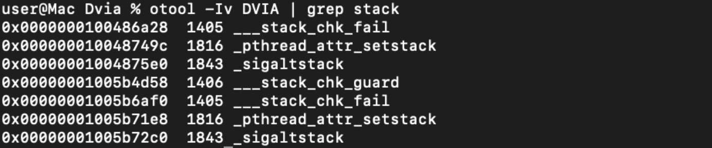

# Приложение не использует функции защиты от переполнений

<table class='noborder'>
    <colgroup>
      <col/>
      <col/>
    </colgroup>
    <tbody>
      <tr>
        <td rowspan="2"></td>
        <td>Критичность:<strong> СРЕДНИЙ</strong></td>
      </tr>
      <tr>
        <td>Способ обнаружения:<strong> SAST, NETWORK</strong></td>
      </tr>
    </tbody>
</table>

## Описание

Платформа iOS предоставляет несколько способов защиты от эксплуатации уязвимостей, связанных с переполнениями. Отключение или неиспользование предложенных средств защиты может привести к возможности более простой эксплуатации уязвимостей.

Хотя в Xcode по умолчанию включены все функции защиты, рекомендуется дополнительно проверить параметры компиляции.

Возможно использование следующих функций:

* ARC — автоматический подсчет ссылок  (функция управления памятью), при необходимости добавляет сообщения о сохранении и освобождении;

* Stack Canary — помогает предотвратить атаки переполнения буфера;

* PIE — Position Independent Executable — включает полную ASLR.

## Рекомендации

Ниже представлено описание каждого из способов защиты и описаны риски, которые могут появиться из-за их отключения.

### Automatic reference counting

Automatic reference counting (автоматический подсчет ссылок) — отслеживание и управление памятью вашего приложения. В большинстве случаев это означает, что управление памятью «просто работает» и не нужно думать о самостоятельном управлении памятью. ARC автоматически освобождает память, которая использовалась экземплярами класса, когда эти экземпляры больше не нужны.

    "Targets"  >  "Build Settings“ > "Objective-C Automatic Reference Counting"  = “YES”

###Stack smashing protection

В ipa-архиве собранного приложения хранится исполняемый бинарный файл формата mach-o. Он содержит следующие секции: статической информации приложения (текст, константы и т. д.), исполняемого кода, включенных статических библиотек и списка динамически подгружаемых ресурсов. Наряду с таблицей разбиения и положения (адресов) этих секций присутствует область данных с флагами этапа компиляции и особенностей его работы для загрузчика ОС.

Одним из них является флаг режима защиты приложения от переполнения стека и перехвата управления. Так же он называется canary-protection (канареечная защита) и заключается в добавлении битовых флагов на границах фрейма стека. При попытке выйти за границы стека и перезаписать адрес возврата из функции произвольным значением перезапишется и сам сигнальный бит, о чем будет оповещена ОС и процесс приложения будет остановлен.

Режим компиляции с защитой стека от переполнения задается средой IDE Xcode, в меню настройки компиляции и задается директивой “-fstack-protector-all“.

<figure markdown>

</figure>

Опция `‘OTHER_CFLAGS = "-fstack-protector-all"’` является обязательной для проектов на C / C++ / Objective-C - языков с ручным управлением памятью.

#### Ручной анализ

Проверить наличие данного режима в собранном приложении можно распаковав ipa-архив и проанализировав хранящийся в нем бинарный файл утилитой “otool” на наличие данной настройки. Для этого можно использовать следующую команду:

    otool -Iv DVIA | grep stack

<figure markdown>

</figure>

На изображении можно видеть наличие признаков защиты стека.

Так же можно воспользоваться утилитой  objection и получить более подробную информацию.

<figure markdown>

</figure>

### Особенности Swift приложений

Swift — это язык с парадигмой «строгой типизации» и проверкой границ объектов на стадии компиляции. Это сводит к минимуму риск выхода за границы стека и перехвата управления процессами благодаря архитектуре самого языка и проверкам компилятора LLVM на стадии компиляции. Компилятор не оставляет информацию о директивах защиты стека в бинарном файле при его сборке.

!!! note "Важно"
    Для проектов, написанных только на Swift, флага в итоговом бинарном файле не будет! Так как для исполняемых файлов написанных на чистом Swift он не имеет смысла.

В свете вышесказанного для достоверного определения включенного режима защиты стека от переполнения необходимо проанализировать исходный код Xcode-проекта и его настроек компиляции, в разделе указанном выше, а в случае возникновения срабатывания на этом флаге определить, используется ли Objective-C при разработке.

### ASLR (Address space layout randomization)
Рандомизация размещения адресного пространства — технология, при использовании которой случайным образом изменяется расположение в адресном пространстве процесса важных структур данных, а именно образов исполняемого файла, подгружаемых библиотек, кучи и стека.

Технология ASLR создана для усложнения эксплуатации нескольких типов уязвимостей. Например, если при помощи переполнения буфера или другим методом атакующий получит возможность передать управление по произвольному адресу, ему нужно будет угадать, по какому именно адресу расположен стек, куча или другие структуры данных, в которые можно поместить код.

    "Targets"  >  "Generate Position-Dependent Code“ = "NO"

    "Targets"  >  "Don't Create Position Independent Executables “ = "NO"

На картинке ниже наглядно показано, как размещаются данные приложения в памяти с использованием рандомизации и без неё:

<figure markdown>

</figure>

## Ссылки

1. [https://ru.bmstu.wiki/PIE_(Position_Independent_Execution)](https://ru.bmstu.wiki/PIE_(Position_Independent_Execution))

2. [https://access.redhat.com/blogs/766093/posts/3548631](https://access.redhat.com/blogs/766093/posts/3548631)

3. [https://ru.bmstu.wiki/ASLR_(Address_Space_Layout_Randomization)](https://ru.bmstu.wiki/ASLR_(Address_Space_Layout_Randomization))

4. [https://bellis1000.medium.com/aslr-the-ios-kernel-how-virtual-address-spaces-are-randomised-d76d14dc7ebb](https://bellis1000.medium.com/aslr-the-ios-kernel-how-virtual-address-spaces-are-randomised-d76d14dc7ebb)

5. [https://developer.apple.com/forums/thread/86355](https://developer.apple.com/forums/thread/86355)

6. [https://developer.apple.com/forums/thread/106300](https://developer.apple.com/forums/thread/106300)

7. [https://sensepost.com/blog/2021/on-ios-binary-protections/](https://sensepost.com/blog/2021/on-ios-binary-protections/)

8. [https://resources.infosecinstitute.com/topic/penetration-testing-for-iphone-applications-part-5/](https://resources.infosecinstitute.com/topic/penetration-testing-for-iphone-applications-part-5/)