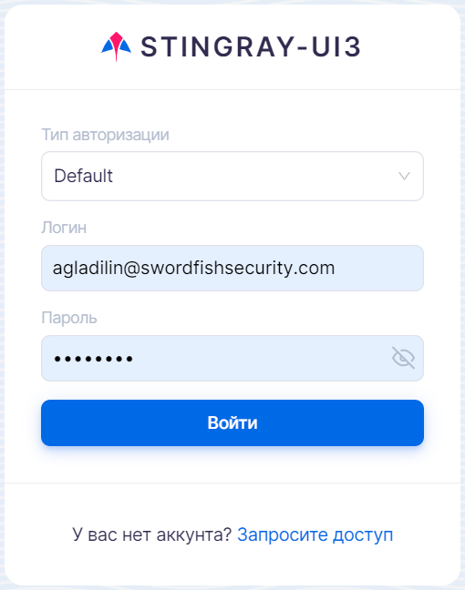
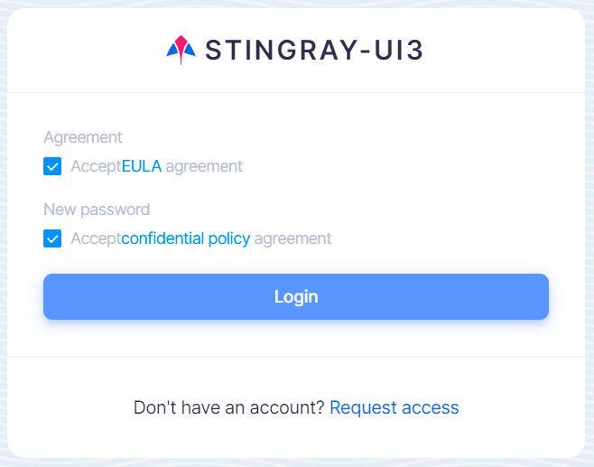
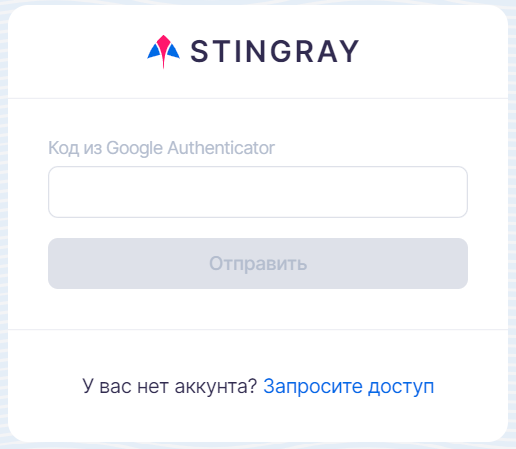

# Аутентификация пользователя

Ссылка для доступа к веб-интерфейсу Stingray должна быть предоставлена администратором. Перейдите по ссылке, чтобы открыть окно аутентификации.

Для входа в систему выберите способ авторизации, введите имя пользователя (логин) и пароль, а затем нажмите кнопку **Войти**.

<figure markdown>

</figure>
 
Если учетные данные введены неправильно, будет отображено сообщение о неверном имени пользователя или пароле.

!!! note "Примечание"
    Вместе со ссылкой доступа предоставляется временный пароль, который должен быть изменен пользователем при первом входе в систему. Вновь устанавливаемый пароль должен состоять не менее чем из 8 символов, а также содержать не менее одной строчной буквы, одной заглавной буквы, одной цифры и одного специального символа.

<figure markdown>

</figure>
 
После смены временного пароля пользователю будет предложено принять пользовательское соглашение и политику конфиденциальности, а затем он перенаправляется на страницу авторизации и в результате ввода учетной записи и нового пароля входит в систему.

Если пароль будет введен неправильно пять раз, последующие попытки авторизации сопровождаются необходимостью введения защитного кода (captcha).
 
Если в профиле пользователя включена двухфакторная аутентификация, см. раздел «[Профиль пользователя](profil_polzovatelya.md)», после ввода логина отображается дополнительное окно, в котором необходимо ввести код, появившийся в приложении Google Authenticator (скачать в [Google Play](https://play.google.com/store/apps/details?id=com.google.android.apps.authenticator2&hl=ru&gl=US) или [App Store](https://apps.apple.com/ru/app/google-authenticator/id388497605)).

<figure markdown>

</figure>
  
Если код двухфакторной аутентификации будет три раза введен неправильно, пользователь блокируется на 5 минут.