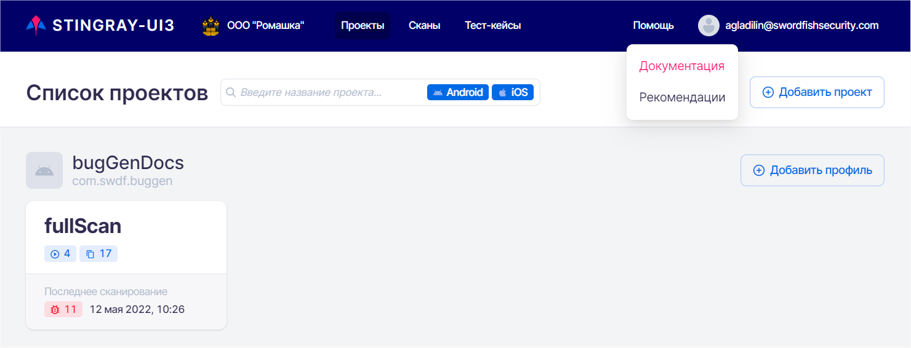

# Документация и рекомендации

В системе находится встроенная документация и рекомендации по устранению уязвимостей, которые доступны без сети Интернет в случае, если установка произведена on-premises.

Наведите курсор на пункт основного меню **Помощь** в правом верхнем углу и выберите необходимый раздел в выпадающем меню.

<figure markdown>

</figure>