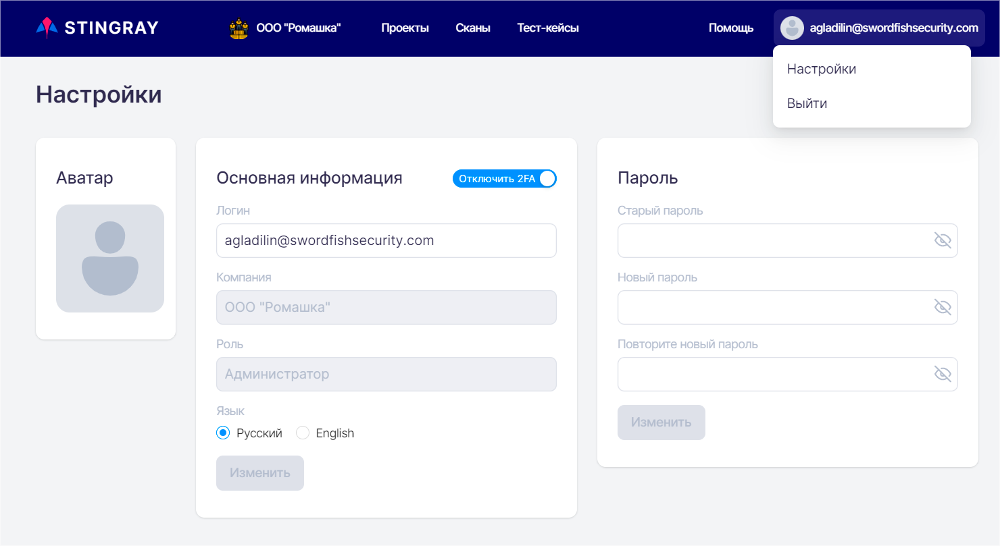
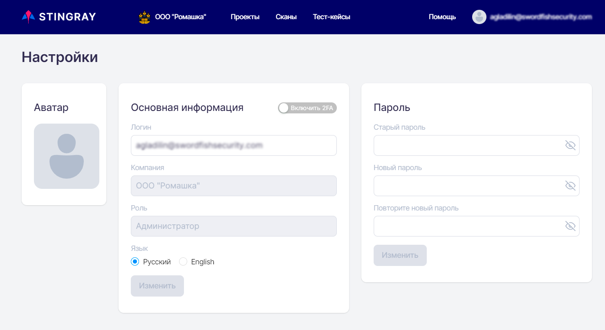
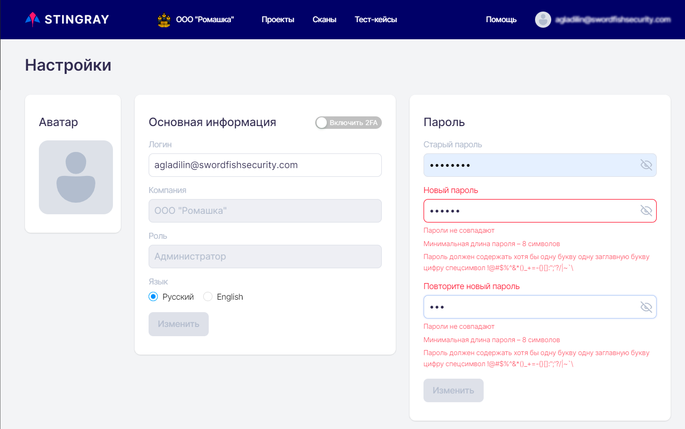

# Профиль пользователя

Для перехода на страницу с настройками профиля пользователя  необходимо в правом верхнем углу окна нажать имя пользователя и выбрать в выпадающем меню пункт **Настройки**. Кроме этого, используя данное выпадающее меню, можно выйти из системы.

<figure markdown>

</figure>
  
На открывшейся странице представлена информация по текущему пользователю:

* **Аватар** пользователя.
* **Логин** пользователя для входа в систему (формат e-mail адреса).
* **Компания** — организация, к которой принадлежит пользователь.
* **Роль** — роль пользователя в системе.
* **Язык** — язык системы для данного пользователя.

Доступные настройки:

* Изменение аватара пользователя.
* Изменение логина (имени) пользователя.
* Изменение языка интерфейса.
* Включение/отключение двухфакторной аутентификации.
* Изменение пароля.

<figure markdown>

</figure>
  
После изменения информации для сохранения изменений нажмите кнопку **Изменить**.

## Двухфакторная аутентификация

Для включения двухфакторной аутентификации нажмите поле **Включить 2FA**. После этого система предложит ввести текущий пароль пользователя.

<figure markdown>

</figure>
  
После ввода пароля отсканируйте появившийся QR-код с помощью Google Authenticator (скачать в [Google Play](https://play.google.com/store/apps/details?id=com.google.android.apps.authenticator2&hl=ru&gl=US) или [App Store](https://apps.apple.com/ru/app/google-authenticator/id388497605)) и введите появившийся в приложении код.

<figure markdown>

</figure>
  
Если введен правильный код, в нижней части пользовательского интерфейса появится подтверждающее сообщение.

Для отключения двухфакторной аутентификации нажмите поле **Выключить 2FA** и в появившемся окне введите код, отображаемый в приложении Google Authenticator (скачать в [Google Play](https://play.google.com/store/apps/details?id=com.google.android.apps.authenticator2&hl=ru&gl=US) или [App Store](https://apps.apple.com/ru/app/google-authenticator/id388497605)). Изменение профиля пользователя также будет подтверждено появлением соответствующего сообщения в верхней части пользовательского интерфейса.

## Изменение пароля пользователя

Предусмотрена возможность изменения пароля пользователя.

Откройте профиль пользователя, см. раздел «[Профиль пользователя](./profil_polzovatelya.md)» в поле **Пароль** введите текущий пароль, а затем дважды новый пароль, в заключение нажмите кнопку **Изменить**. При необходимости можно включить отображение паролей, нажав иконку .

<figure markdown>

</figure>