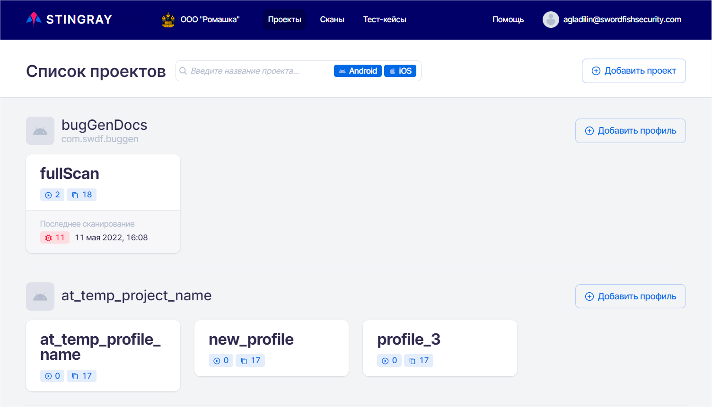
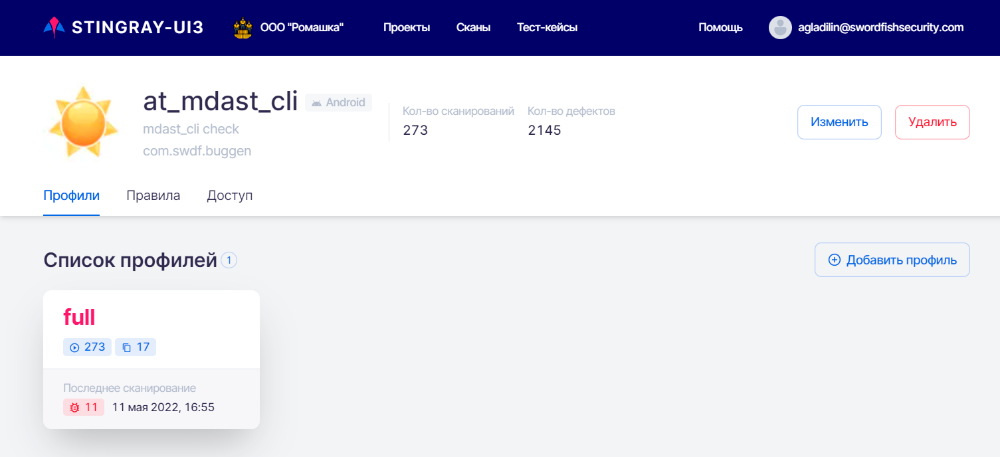
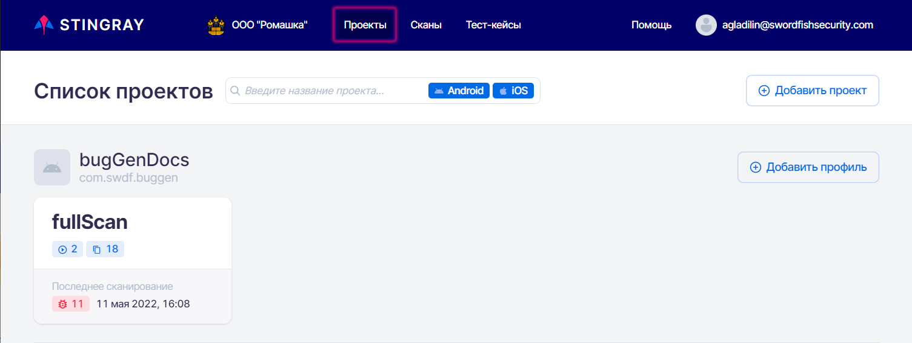
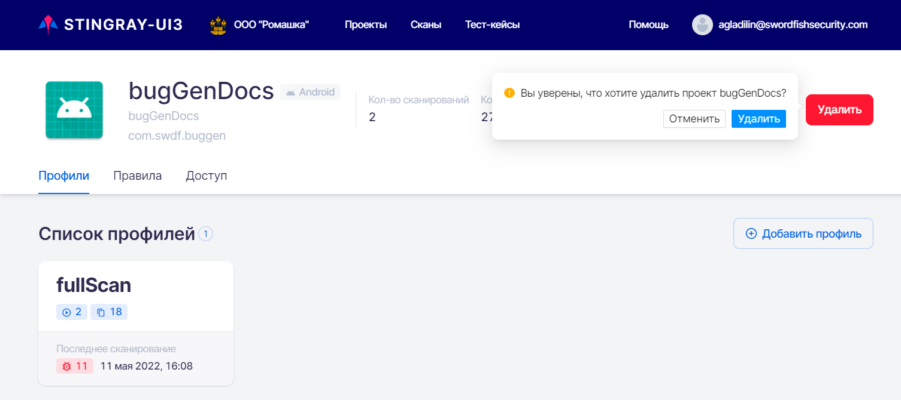
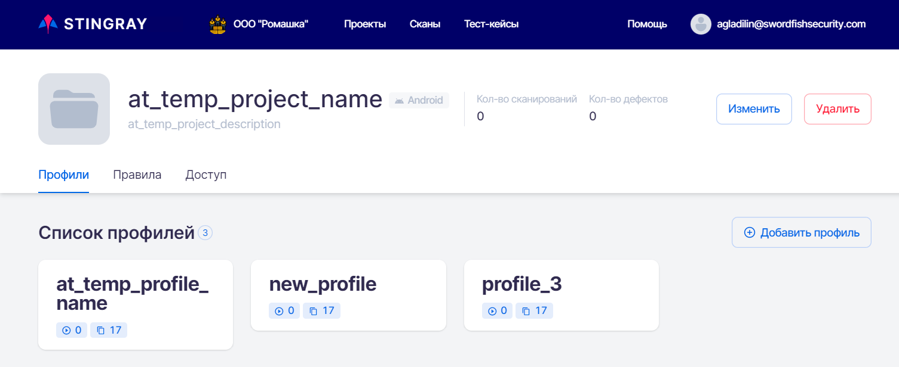
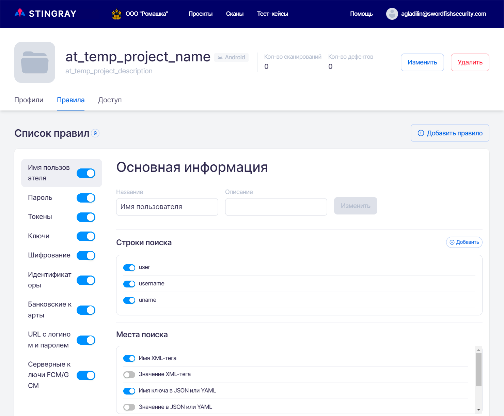
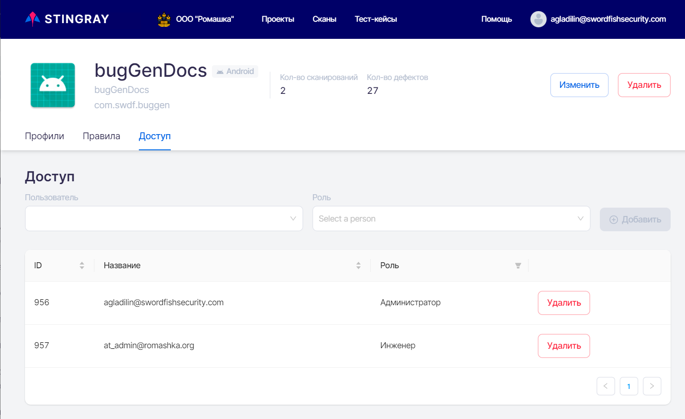

# Проекты

## Список проектов

На странице **Проекты** указаны все существующие в данной Компании проекты и их профили сканирования.

<figure markdown>

</figure>

Для каждого проекта отображаются его название, имя пакета (package name) и архитектура приложения. На данной странице можно получить краткую информацию о существующих профилях проекта, количестве найденных дефектов за все время существования проекта, количестве проведенных сканирований, дате последнего сканирования и о количестве включенных модулей. 

Также можно добавить новый проект или добавить новый профиль сканирования для существующего проекта.

По нажатию на имя проекта открывается страница проекта с общей информацией и тремя вкладками: **Профили**, **Правила** и **Доступ**.

## Информация о проекте

В верхней части страницы проекта представлена общая информация по проекту, включающая:

* Аватар проекта.
* Название проекта.
* Описание проекта.
* Название пакета.
* Количество сканирований в рамках проекта.
* Архитектура проекта (Android или iOS).

<figure markdown>

</figure>
  
## Добавление / редактирование / удаление проекта

Для работы с проектами необходимо выбрать пункт **Проекты** в основном меню, расположенном в верхней части экрана.

<figure markdown>

</figure>
  
Для добавления нового проекта нажмите на кнопку **Добавить проект** справа на странице **Проекты**.

В появившемся окне **Добавление проекта** введите название проекта, его краткое описание и архитектуру (Android/iOS). Также в соответствующем поле можно указать имя сканируемого пакета (приложения). Если оставить это поле пустым, оно будет автоматически заполнено после первого сканирования. При выборе опции **Скопировать профили из существующего проекта** в появившемся поле **Проект для копирования** можно выбрать уже существующий в компании проект. Это позволит создать новый проект вместе с уже существующими и настроенными в выбранном для копирования проекте профилями и избежать их повторного добавления и настройки в новом проекте.  

Нажмите кнопку **Добавить** в правом нижнем углу окна. Вновь созданный проект появится на странице **Проекты**.

<figure markdown>

</figure>
  
Для редактирования кликните мышкой имя проекта на странице **Проекты**.

На открывшейся странице проекта нажмите кнопку **Изменить**:

<figure markdown>

</figure>
 
В появившемся окне **Изменение данных проекта** можно отредактировать следующие параметры:

* В поле **Название** отредактировать имя проекта.
* Изменить описание проекта в соответствующем поле.
* Изменить имя пакета в соответствующем поле.

<figure markdown>

</figure>

После редактирования информации проекта нажмите кнопку **Обновить** в правом нижнем углу окна.

Изменить аватар проекта можно, кликнув мышкой текущий аватар и выбрав файл с картинкой для нового.

Также на странице проекта можно его удалить. Для этого нажмите кнопку **Удалить** в правой части экрана и подтвердите это действие в появившемся диалоговом окне.

<figure markdown>

</figure>

## Список профилей проекта

На вкладке **Профили** доступно управление профилями сканирования, включенными в данный проект. Доступен просмотр и добавление нового профиля сканирования. Более подробная информация о работе с профилями приведена в разделе «[Профили](./profile.md)».

<figure markdown>

</figure>
  
## Правила

На вкладке **Правила** доступно управление правилами анализа уязвимостей, которые применяются для данного проекта. Порядок работы с правилами описан в разделе «[Правила](./pravila.md)».

<figure markdown>

</figure>
 
## Назначение проектных прав доступа

На вкладке **Доступ** осуществляется назначение проектных прав доступа как для отдельных пользователей, так и для групп. Более подробная информация о ролевой модели приложения приведена в разделе «[Пользователи, группы, проекты](../ag/polzovateli.md   )».

<figure markdown>

</figure>