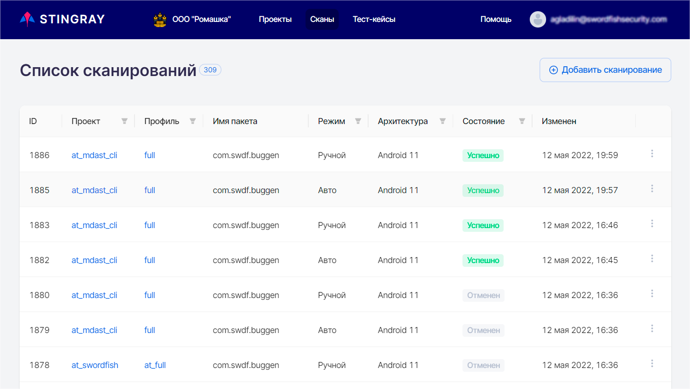
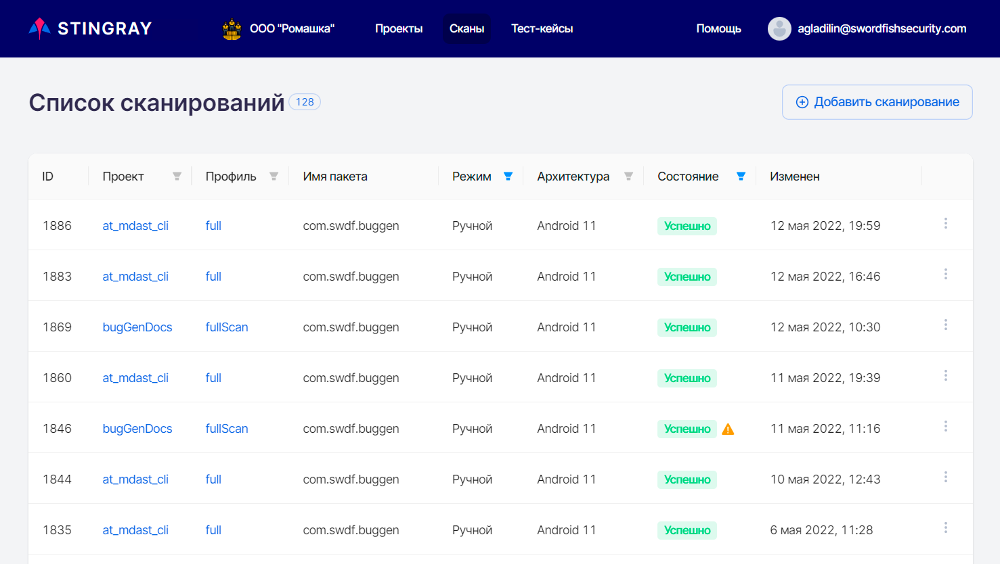
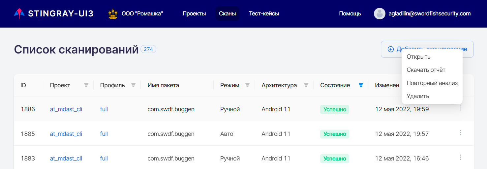
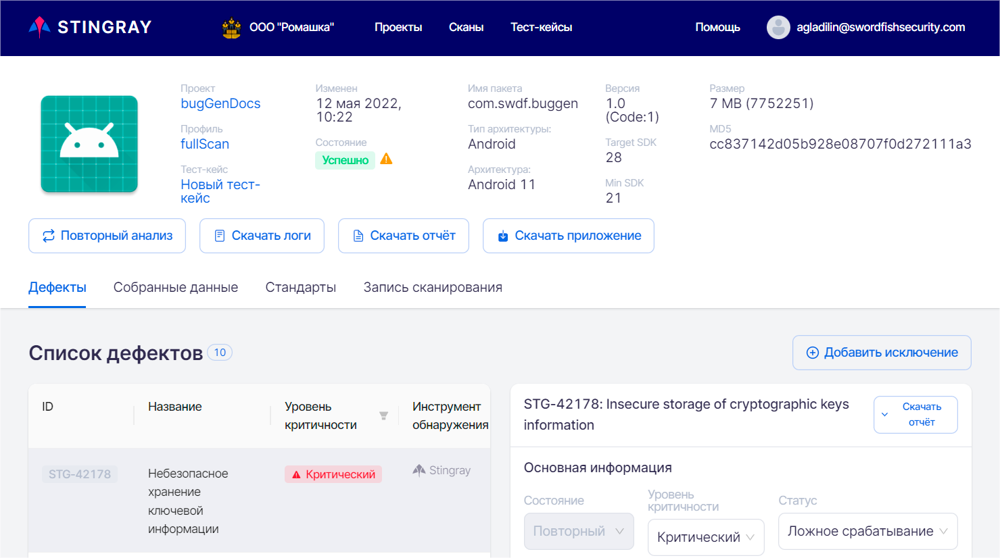
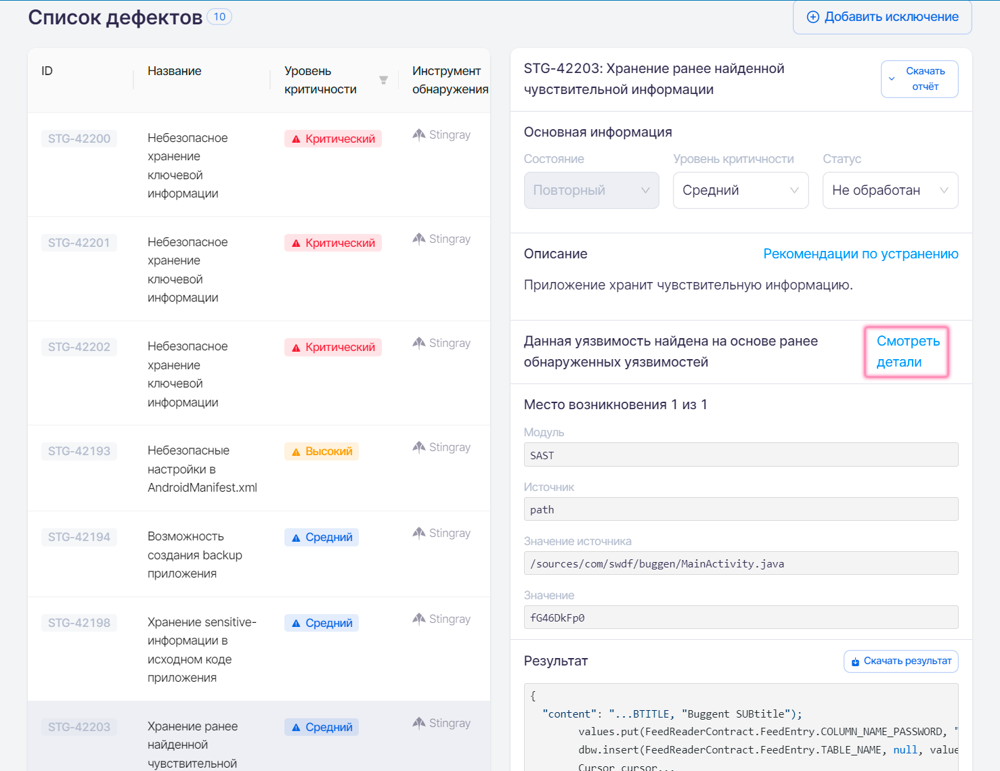
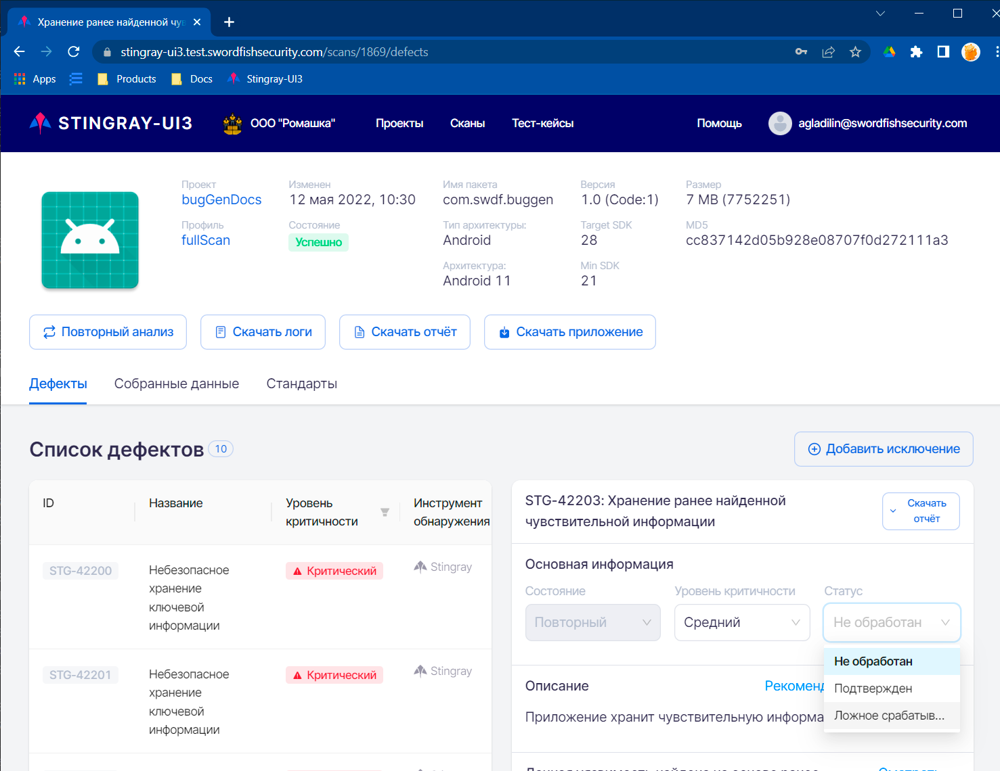
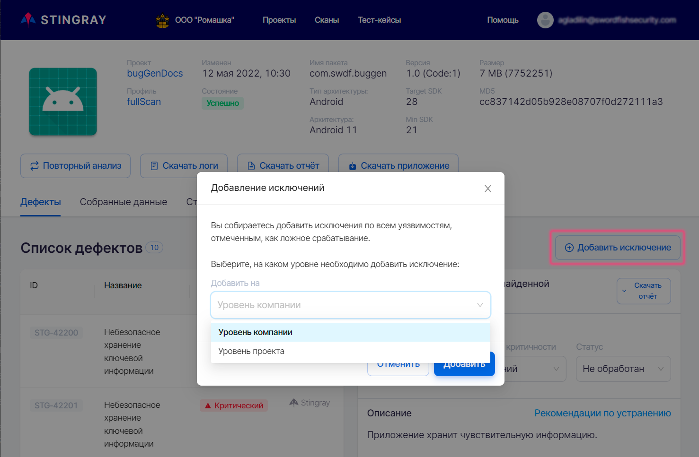
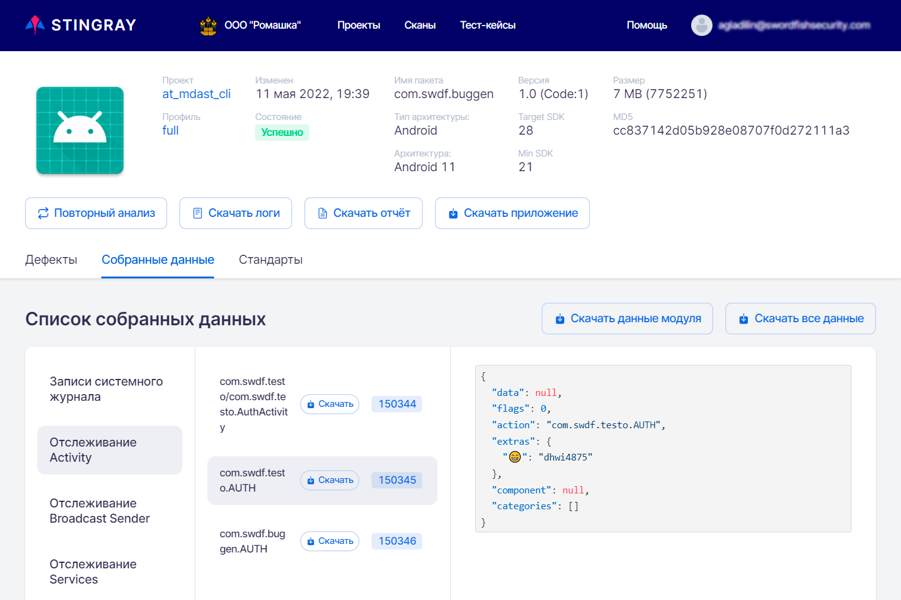
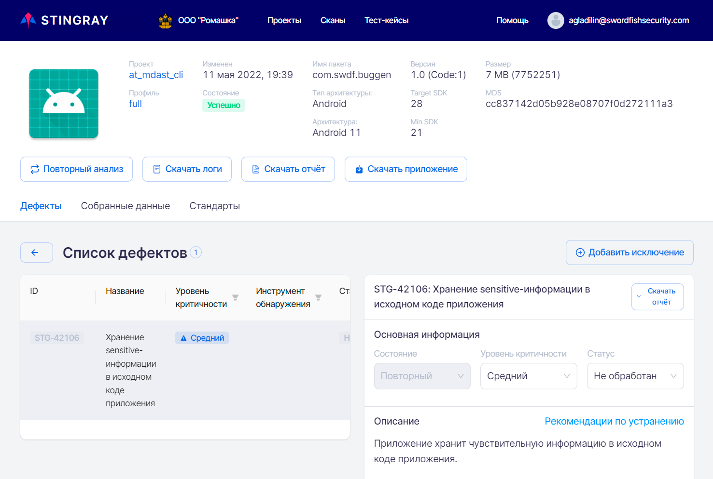

# Результаты сканирований

## Список результатов

При выборе пункта меню **Сканы** отображается список всех проведенных сканирований. Каждое сканирование представлено одной строкой. Данные о результатах сканирований автоматически обновляются каждые 10 секунд, что освобождает пользователя от необходимости обновлять страницу вручную.

<figure markdown>

</figure>

В списке отображаются сканирования, отсортированные по **ID** сканирования. В таблице присутствует следующая информация:

* **ID** — внутренний идентификатор сканирования. При нажатии на **ID** сканирования происходит переход к детальным результатам выбранного сканирования.
* **Проект** — имя проекта, в рамках которого проводилось сканирование. Данное значение представлено в виде ссылки, нажав которую можно перейти в соответствующий проект.
* **Профиль** — профиль сканирования, с которым было проанализировано приложение. Данное значение представлено в виде ссылки, нажав которую можно перейти в соответствующий профиль сканирования.
* **Имя пакета** анализируемого приложения.
* **Режим** — режим сканирования, ручной или автоматический.
* **Архитектура** — тип архитектуры, на которой было проведено сканирование (Android или iOS).
* **Имя пакета** анализируемого приложения.
* **Состояние** — статус сканирования, может принимать несколько значений:
    * **Успешно** — сканирование завершилось без ошибок. Если сканирование в целом прошло успешно, но наблюдались сбои в работе отдельных модулей, рядом со статусом отображается значок . При наведении на него курсора появляется более подробная информация о сбоях.
    * **Создан** — сканирование создано и помещено в очередь сканирования.
    * **Запускается** — сканирование запущено, идет процесс установки и запуска целевого приложения.
    * **Запущен** — происходит процесс сканирования.
    * **Анализ** — сканирование остановлено, осуществляется процесс анализа собранной информации.
    * **Отменен** — сканирование отменено с использованием расположенного справа раскрывающегося меню.
    * **Неуспешно** — сканирование завершено с ошибкой. Рядом со статусом отображается значок . При наведении на него курсора появляется более подробная информация об ошибке.
    * **Ожидание повторного анализа** — был запущен и еще не завершился повторный анализ результатов сканирования.
* **Изменен** — время последнего изменения статуса сканирования.

Для отображения только необходимых результатов в колонках, отмеченных значком фильтра , предусмотрена установка фильтра. После установки фильтра в колонке цвет значка меняется на синий . При выборе нескольких фильтров они работают вместе, то есть при выборе режима **Ручной** и состояния **Успешно** будут найдены и отображены все успешно завершившиеся сканирования с ручным режимом запуска.

<figure markdown>

</figure>
  
Чтобы убрать установленный фильтр, нажмите на значок фильтра  и выберите пункт **Сбросить** в выпадающем меню:

<figure markdown>

</figure>

Кроме этого, находясь на данной странице, можно:

* Открыть страницу с детальными результатами сканирования.
* Скачать PDF-отчет о сканировании.
* Инициировать повторный анализ.
* Удалить результаты сканирования. 

Для выполнения перечисленных действий используйте соответствующие пункты расположенного справа раскрывающегося меню «»:

<figure markdown>

</figure>
 
## Результаты сканирования

Чтобы перейти на страницу с детальными результатами сканирования, нажмите либо на строку нужного сканирования в таблице **Список сканирований**, либо на расположенное справа в строке сканирования раскрывающееся меню «» и выберите пункт **Открыть**. На открывшейся странице содержится вся информация по анализу приложения: общая информация, выявленные уязвимости, собранные за время работы приложения данные, соответствие стандартам и требованиям. Для выбора доступно три или четыре вкладки в зависимости от режима сканирования: **Дефекты**, **Собранные данные**, **Стандарты**, **Запись сканирования**. Последняя вкладка присутствует только у сканирований, проведенных в автоматическом режиме.

### Общая информация

Общая информация приведена в верхней части страницы с детальными результатами сканирования. Она содержит сведения о проведенном сканировании и краткую информацию о проверенном приложении.

<figure markdown>

</figure>
  
Здесь представлена следующая общая информация по сканированию:

* **Проект**, в рамках которого проводилось сканирование. Данное значение представлено в виде ссылки, нажав которую можно перейти в соответствующий проект.
* **Профиль**, в рамках которого проводилось сканирование. Данное значение представлено в виде ссылки, нажав которую можно перейти в соответствующий профиль сканирования.
* **Тест-кейс** — название используемого тест-кейса. Данное значение представлено в виде ссылки, нажав которую можно перейти на страницу соответствующего тест-кейса. Это поле присутствует только у сканирований, проведенных в автоматическом режиме.
* **Изменен** — дата сканирования.
* **Состояние** — статус проведенного сканирования. 
* **Имя пакета** — название пакета приложения в системе.
* **Тип архитектуры / Архитектура** — архитектура сканируемого приложения (Android или iOS). 
* **Версия** — название и код версии, указанные в манифесте приложения для более точной идентификации анализируемого приложения.
* **Target SDK/Min SDK** — версии SDK, для которых собрано данное приложение
* **Размер** — размер загруженного файла приложения.
* **MD5** — хеш-сумма загруженного файла приложения.

Кнопки, расположенные ниже общей информации, позволяют выполнить следующие действия:

* **Повторный анализ** — провести повторный анализ результатов сканирования с применением актуальных правил анализа уязвимостей для данного приложения.
* **Скачать логи** — скачать лог-файл сканирования.
* **Скачать отчет** — получить подробный отчет о результатах сканирования в формате PDF.
* **Скачать приложение** — скачать файл сканируемого приложения.

### Дефекты

На каждую выявленную уязвимость системой заводится дефект. Все найденные во время сканирования дефекты показаны в **Списке дефектов** в левой половине вкладки **Дефекты**. В правой части данной вкладки представлена информация о выявленной уязвимости с ее детальным описанием, а также даны рекомендации по ее устранению.

<figure markdown>

</figure>

Для удобства работы с дефектами в колонках, отмеченных значком фильтра , существует возможность выбрать и применить для отображаемых дефектов фильтр. Для этого нажмите значок фильтра  и выберите из выпадающих списков одно или несколько значений для фильтрации по параметрам **Уровень критичности** и **Инструмент обнаружения**. Если выбран уровень критичности **Высокий** и инструмент обнаружения **Stingray**, то будут отображаться все обнаруженные системой Stingray дефекты с высоким уровнем критичности. При установке фильтра в колонке цвет значка меняется на синий . Чтобы убрать установленный фильтр, нажмите на значок фильтра  и выберите пункт **Сбросить** в выпадающем меню.

На вкладке **Дефекты** представлены следующие сведения о дефекте:

* **ID** дефекта в системе.
* **Название** обнаруженной уязвимости.
* **Уровень критичности** дефекта (Критический, Высокий, Средний, Низкий, Инфо).
* **Инструмент обнаружения** — название инструмента, обнаружившего дефект (Stingray, Appscreener, Oversecured).
* **Статус** дефекта (Не обработан, Подтвержден, Ложное срабатывание).

Начальное заполнение значений полей дефектов производится системой автоматически во время анализа результатов.

При нажатии на дефект в **Списке дефектов** справа отображается детальная информация о нем.

<figure markdown>

</figure>
 
Приводится следующая информация:

1.	**ID** дефекта в системе.
2.	Название выявленной уязвимости. Рядом с названием располагается кнопка **Скачать отчет**, нажав которую можно получить отчет об уязвимости в формате PDF.
3.	**Состояние** дефекта:
    1.	**Новый** — если этот дефект был впервые найден во время этого сканирования, либо он уже встречался ранее, а затем проблема была решена и дефект был закрыт, но при этом сканировании вновь проявился.
    2.	**Повторный** — если этот дефект был уже ранее найден во время предыдущих сканирований.
    3.	**Исправленный** — это состояние для тех дефектов, которые были найдены в предыдущих сканированиях, но в текущем сканировании их уже нет.
4.	**Уровень критичности** дефекта. В этом поле отображается текущее значение критичности дефекта и предоставляется возможность поменять критичность, выбрав новое значение из выпадающего списка.
5.	**Статус** дефекта. В этом поле отображается текущий статус дефекта и предоставляется возможность поменять статус, выбрав новое значение из выпадающего списка.
6.	**Описание** дефекта в краткой форме характеризует найденную уязвимость. 
7.	Рядом с **Описанием** располагается ссылка на **Рекомендации по устранению** с подробным описанием уязвимости, рекомендациями по исправлению, примерами исходного кода и ссылками на материалы по этой уязвимости.

    !!! note "Примечание"
        Отдельно следует отметить дефекты, выявленные модулем **Поиск ранее найденной чувствительной информации**. В поле **Описание** таких дефектов, кроме упомянутой выше информации, можно найти ссылку **Смотреть детали** на уязвимости, которые послужили основанием для создания такого дефекта.

    <figure markdown>
    
    </figure>

8.	**Место возникновения** дефекта. Если обнаружено несколько уязвимостей одного типа, они группируются в один дефект, а справа от данного поля появляются стрелки , с помощью которых можно переходить между уязвимостями. Ниже приводится важная фактическая информация по найденной уязвимости, например, обнаруженная чувствительная информация, место ее обнаружения, и т. п.  Для удобной работы с информацией из этих полей можно использовать расположенную в них справа кнопку **Скопировать**. 
9.	В поле **Результат** отображается фрагмент кода или содержимое файла (до 5000 знаков), в котором обнаружена уязвимость. Если необходимо загрузить соответствующий файл целиком, нажмите кнопку **Скачать результат**, расположенную справа.

Если в результате анализа были найдены уязвимости, которые определяются нами как ложные срабатывания, они могут быть добавлены в исключения как на уровне проекта, так и на уровне компании (ко всем проектам компании). Для этого необходимо выбрать один или несколько обнаруженных дефектов, изменить их **Статус** на «Ложное срабатывание» и нажать кнопку **Добавить исключение**, расположенную в верхнем правом углу вкладки **Дефекты**.

<figure markdown>

</figure>
  
В появившемся окне **Добавление исключений** выберите, на каком уровне вы хотите добавить исключения — на уровне проекта или на уровне компании, а затем нажмите кнопку **Добавить**.

<figure markdown>

</figure>
  
Также можно добавить исключение для отдельной уязвимости, нажав кнопку **Добавить исключение** рядом с заголовком **Найдено правилом** в описании соответствующей уязвимости.

<figure markdown>

</figure>
  
В появившемся окне **Добавление исключения** выберите, на каком уровне вы хотите добавить исключение — на уровне проекта или на уровне компании, а затем нажмите кнопку **Добавить**.

В результате добавления исключений, при повторном анализе результатов или при следующем сканировании в рамках этого проекта, если выбран уровень проекта, или для всех проектов компании, если выбран уровень компании, такие уязвимости учитываться не будут.

### Собранные данные

Для работы с собранными в ходе сканирования данными выберите вкладку **Собранные данные** на странице с детальными результатами сканирования.

На вкладке **Собранные данные** отображается вся информация о работе приложения, собранная за время сканирования. Информация разделена по модулям, которые отвечают за сбор данных. Для модулей предусмотрена возможность скачивания собранных данных в виде zip-архива с помощью кнопки **Скачать данные модуля**, или же, возможно скачать все данные сканирования сразу в одном архиве с помощью кнопки **Скачать все данные**.

<figure markdown>

</figure>
  
На данной вкладке доступны данные, собранные во время сканирования приложения всеми включенными в профиле модулями. Модуль для просмотра собранных данных может быть выбран в левой панели **Списка собранных данных**. Каждый из модулей собирает данные, специфичные только для него. Соответственно, формат представления данных на вкладке отличается для каждого модуля.

На рисунке выше в качестве примера приведены данные, собранные модулем **Сетевая активность**. В этом случае были собраны данные, переданные по сети — адрес, протокол, время, метод, порт, а также содержание запроса и ответа. Такого сорта дополнительная информация может оказаться полезной в работе с результатами анализа.

На рисунке ниже приведен еще один пример, иллюстрирующий другую область работы приложения — данные, собранные модулем **Отслеживание Activity**. Здесь Activity — это все различные экраны приложения, которые были запущены во время сканирования. Для каждого экрана (Activity) приведены его имя и параметры запуска.

<figure markdown>

</figure>
  
Результаты работы всех модулей собраны в одной системе, что значительно упрощает их анализ. Такой подход обладает явными преимуществами по сравнению с ситуацией, когда данные о работе приложения последовательно и в различных форматах собираются несколькими утилитами.

Помимо предоставления пользователям возможности работы с собранными данными, система на их основе делает выводы об уязвимостях приложения. Правила анализа собранных данных для поиска уязвимостей подробно описаны в разделах «[Правила](./pravila.md)» и «[Правила анализа на уровне Компании](../ag/pravila_analiza_na_urovne_organizacii.md)».

### Стандарты

Для работы с требованиями стандартов выберите на странице с детальными результатами сканирования вкладку **Стандарты**. На этой вкладке отображаются результаты проверки выполнения требований для просканированного приложения. На вкладке **Стандарты** представлено соответствие стандартам безопасности, выбранным в профиле сканирования. Требования, категории требований и стандарты, в которых были выявлены несоответствия, отмечаются красным цветом.

<figure markdown>

</figure>
 
Если кликнуть мышкой по невыполненному требованию, отмеченному красным цветом на вкладке  в левой части, в правой части на вкладке **Дефекты** появится список типов дефектов, которые были проверены для выбранного требования.

<figure markdown>

</figure>

В случае обнаружения дефектов определенного типа при проверке требования, этот тип дефектов отмечается значком , а само требование считается невыполненным и отмечается красным цветом. Если дефектов определенного типа при проверке требования выявлено не было, такой тип дефектов отмечается значком . Требование в целом считается выполненным, если при его проверке не было выявлено ни одного дефекта из числа относящихся к этому требованию типов дефектов.

При нажатии в области **Дефекты** на тип дефекта, отмеченного значком , появится окно с детальной информацией по дефектам данного типа:

<figure markdown>

</figure>
 
Для возвращения к списку требований нажмите кнопку  в левом верхнем углу.

На вкладке **Стандарты** доступны данные по выполнению требований всех выбранных в профиле сканирования стандартов. Если в профиле добавить еще один стандарт к списку проверяемых, то после этого при просмотре результатов всех уже ранее проведенных с этим профилем сканирований, на вкладке **Стандарты** будет отображаться также соответствие ранее собранных результатов и вновь выбранного в профиле стандарта.

### Запись сканирования

Данная вкладка доступна только для результатов автоматического сканирования и предоставляет возможность просмотра видеозаписи проведенного сканирования и процесса выполнения тест-кейса.

<figure markdown>

</figure>

### Снимок экрана

Для сканирований, завершенных со статусом **Неуспешно**, причиной завершения которых стала невозможность запуска приложения на агенте, в результате сканирования доступна вкладка **Снимок экрана**, на которой сохранен снимок экрана эмулятора в момент возникновения ошибки.

<figure markdown>

</figure>

### Лог сканирования

Дополнительная вкладка **Лог** предоставляет возможность просмотра лога сканирования. Она доступна только во время анализа результатов сканирования.

<figure markdown>

</figure>