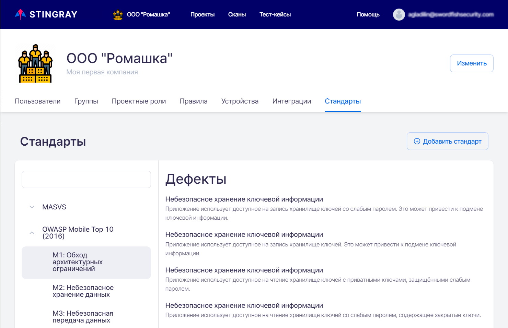

# Стандарты на уровне Компании

Для перехода на вкладку **Стандарты** необходимо в левом верхнем углу нажать название компании, а далее на странице настроек выбрать соответствующую вкладку.

<figure markdown>

</figure>
 
На данной вкладке представлены стандарты информационной безопасности и входящие в них требования, на соответствие которым можно проверить сканируемые приложения. На этой вкладке можно добавить, изменить или удалить стандарт на уровне Компании. Проверка на соответствие каждому из этих стандартов может быть проведена во всех проектах данной Компании.

Принципы работы со стандартами на уровне Компании и на уровне проекта не отличаются друг от друга. 

Описание работы со стандартами и входящими в них требованиями, а также их добавление, редактирование и удаление на уровне проекта приведено в разделе «[Требования]()» Руководства пользователя.