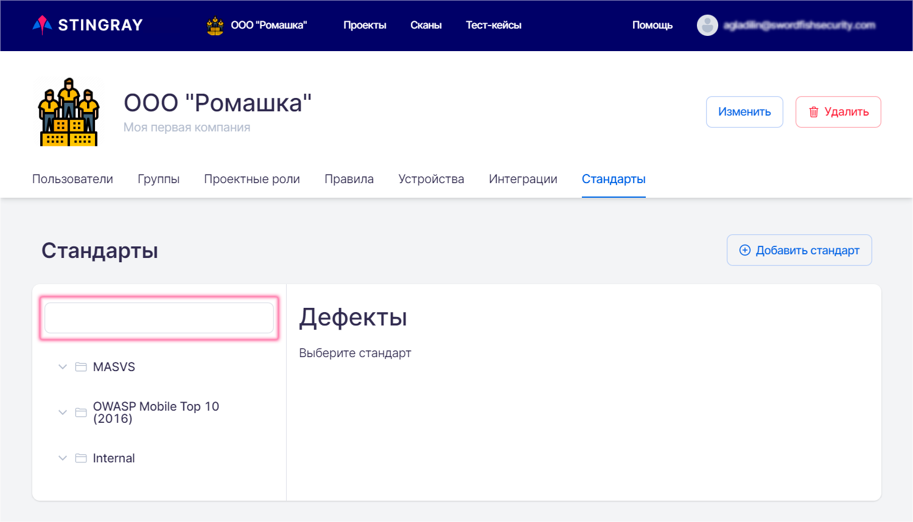
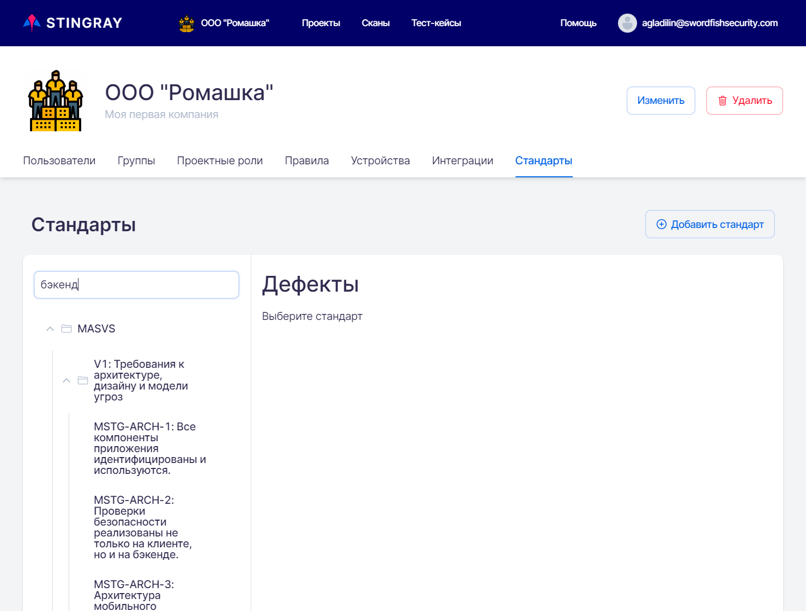
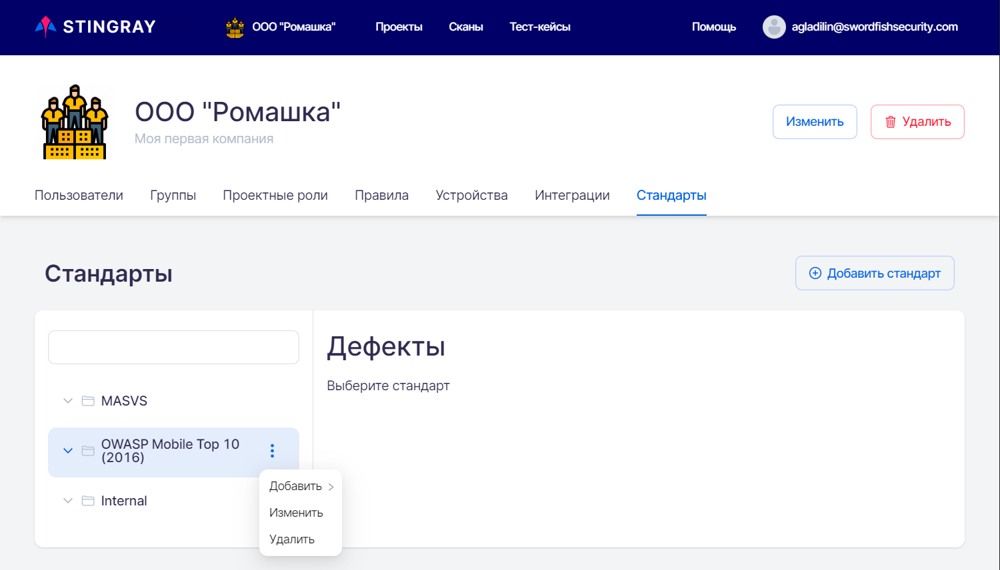
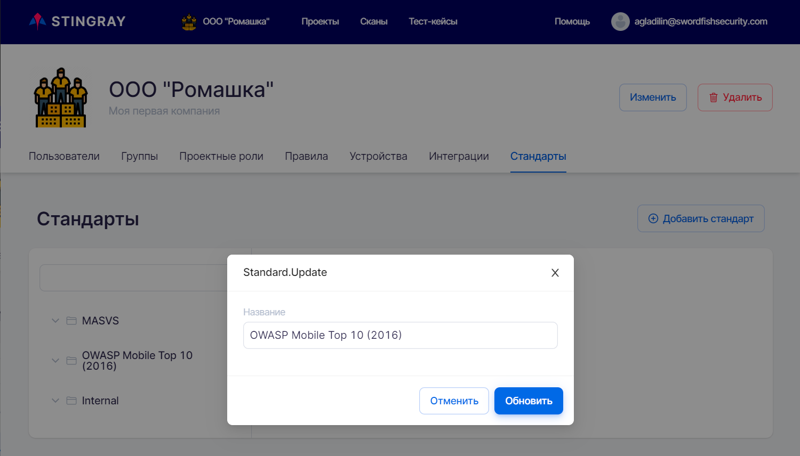
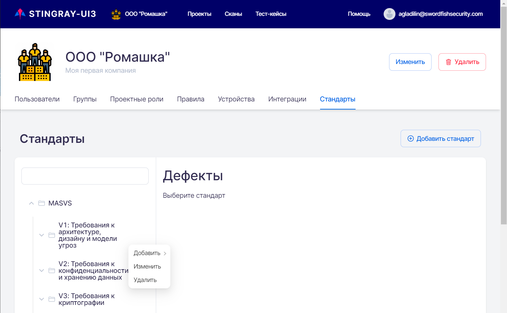
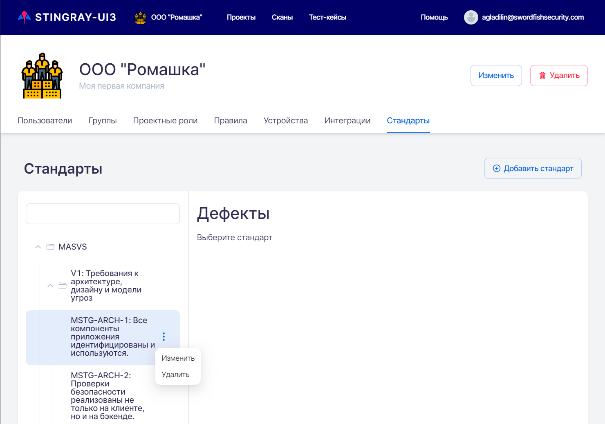
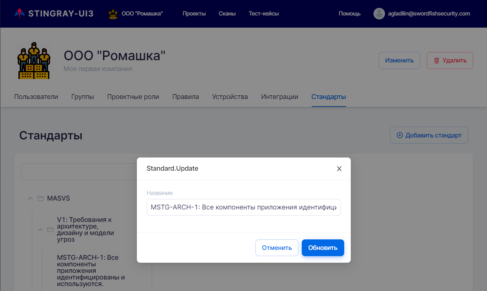
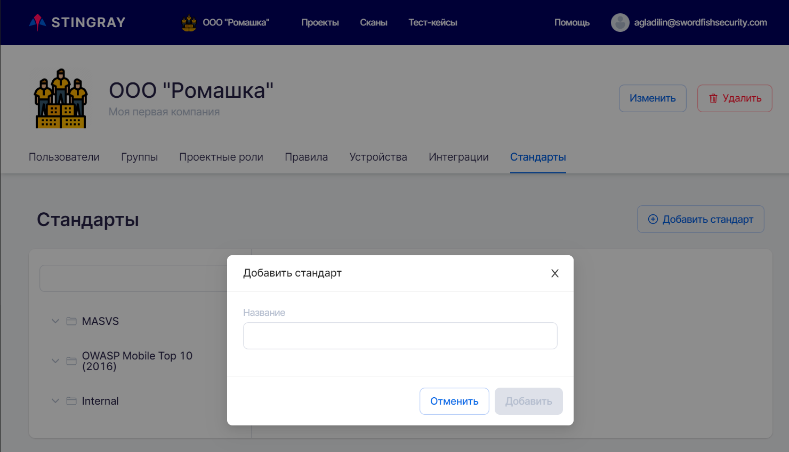

# Стандарты

Для перехода на вкладку **Стандарты** необходимо в левом верхнем углу нажать название компании, а далее на странице настроек выбрать соответствующую вкладку.

<figure markdown>

</figure>
 
На данной вкладке представлены стандарты информационной безопасности и входящие в них требования, на соответствие которым можно проверить сканируемые приложения. На этой вкладке можно добавить, изменить или удалить стандарт на уровне Компании. Проверка на соответствие каждому из этих стандартов может быть проведена во всех проектах данной Компании.

Для удобства работы можно использовать поле поиска требований стандартов:

<figure markdown>

</figure>
 
После ввода текста в поле поиска, все категории (группы) требований, в которые входят содержащие этот текст требования, будут развернуты и отображены в левой части вкладки **Стандарты**:

<figure markdown>

</figure>
 
Рассмотрим способы управления стандартами и требованиями в системе.

## Редактирование существующего стандарта

При редактировании существующего стандарта требований можно провести несколько операций:

* Изменить название стандарта.
* Удалить стандарт.
* Добавить новую категорию (группу требований).
* Добавить новое требование.
* Изменить название категории.
* Удалить категорию.
* Изменить название требования.
* Удалить требование.

Для корректировки названия или удаления существующего стандарта наведите мышку на название стандарта. Справа от названия стандарта появится значок «».

<figure markdown>

</figure>
 
Нажмите левой кнопкой мышки на значок «» и выберите из выпадающего меню пункт **Изменить** для редактирования названия стандарта или пункт **Удалить** для его удаления.

<figure markdown>

</figure>

Для редактирования названия стандарта выберите пункт выпадающего меню **Изменить**, в появившемся окне скорректируйте название стандарта и нажмите кнопку **Обновить**.

<figure markdown>

</figure>
  
Для добавления категории или требования выберите пункт выпадающего меню **Добавить**, затем подпункт **Категория** или **Требование** соответственно, введите название категории или требования в поле ввода и нажмите кнопку **Сохранить**.

<figure markdown>

</figure>
  
Для корректировки названия или удаления существующей категории наведите мышку на её название. Справа от названия категории появится значок <nobr>«»</nobr>. Нажмите левой кнопкой мышки на значок «» и выберите из выпадающего меню пункт **Изменить** для редактирования названия категории или пункт **Удалить** для её удаления.

<figure markdown>

</figure>
 
Для редактирования названия категории выберите пункт выпадающего меню **Изменить**, скорректируйте название категории в появившемся окне и нажмите кнопку **Обновить**.

<figure markdown>

</figure>
  
Для корректировки названия или удаления существующего требования наведите мышку на его название. Справа от названия требования появится значок «». Нажмите левой кнопкой мышки на значок «» и выберите из выпадающего меню пункт **Изменить** для редактирования названия требования или пункт **Удалить** для его удаления.

<figure markdown>

</figure>
 
Для редактирования названия требования выберите пункт выпадающего меню **Изменить**, скорректируйте название требования в появившемся окне и нажмите кнопку **Обновить**.

<figure markdown>

</figure>
 
## Добавление нового стандарта

Для добавления нового стандарта нажмите кнопку **Добавить стандарт** справа вверху на вкладке **Стандарты**. В появившемся окне укажите название нового стандарта и нажмите кнопку **Добавить**. Вновь созданный стандарт будет добавлен в список стандартов в системе.

<figure markdown>

</figure>
 
## Связывание типов дефектов с требованиями

Система содержит в себе определенный набор требований и определенный набор типов дефектов. Как было сказано выше, с каждым требованием соотносятся определенные типы дефектов, при нахождении которых в приложении требование будет считаться не выполненным.

Чтобы посмотреть, какие типы дефектов связаны с требованием, и/или связать с требованием новый тип дефектов, выберите интересующее требование. В правой части экрана появится список уже связанных с ним дефектов и поле для выбора новых типов.

<figure markdown>

</figure>
 
Вверху правой части области **Дефекты** в поле **Выберите дефект, чтобы добавить** можно выбрать из выпадающего списка один из имеющихся в системе типов. Вновь выбранный тип дефектов будет добавлен в список дефектов, связанных с этим требованием.

<figure markdown>

</figure>