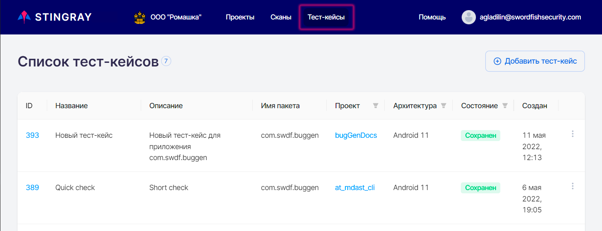
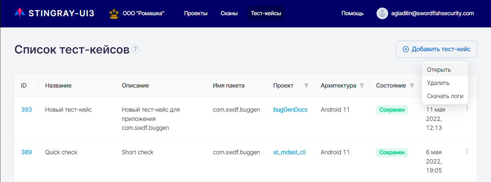
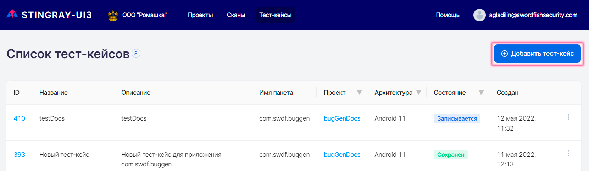
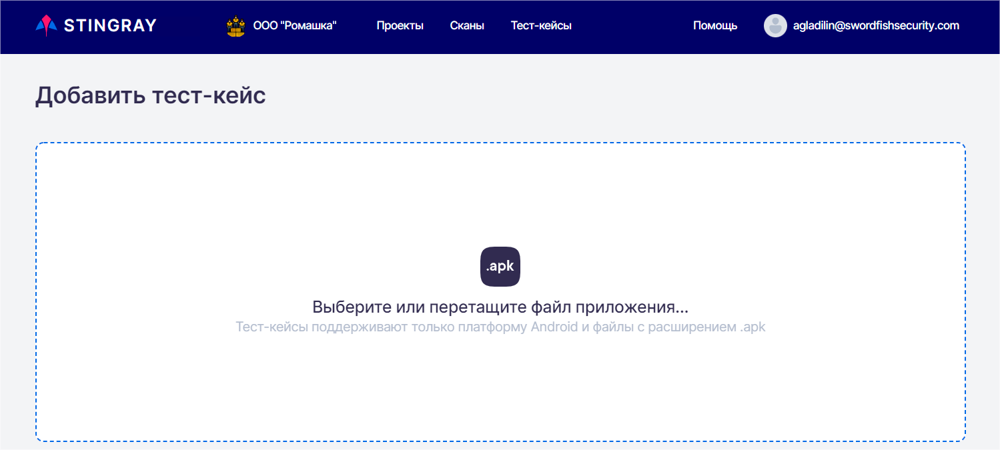
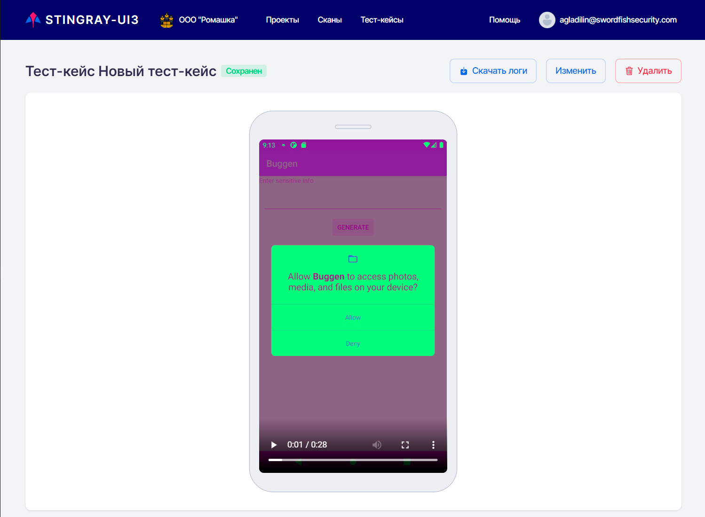
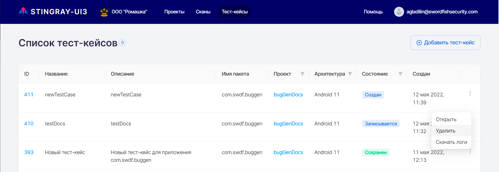

# Тест-кейсы

Работа с тест-кейсами в системе производится через пункт основного меню **Тест-кейсы**.

<figure markdown>

</figure>
 
На странице **Тест-кейсы** отображены все ранее записанные тест-кейсы для различных проектов и приложений. Каждый тест-кейс представлен отдельной строкой.

Для каждого тест-кейса приведена следующая информация:

* **ID** — цифровой идентификатор тест-кейса.
* **Название** — имя записанного тест-кейса.
* **Описание** — подробное описание тест-кейса.
* **Имя пакета** — имя пакета (приложения), для которого был записан тест-кейс.
* **Проект** — проект, для которого записывался тест-кейс.
* **Архитектура** — тип архитектуры, на которой был записан тест-кейс (Android или iOS).
* **Состояние** — статус записи тест-кейса.
* **Создан** — дата создания тест-кейса.

На данной странице можно, используя расположенное справа в строке каждого тест-кейса раскрывающееся меню «», открыть страницу с подробной информацией о тест-кейсе, удалить тест-кейс или скачать лог-файл для него:

<figure markdown>

</figure>
 
Открыть тест-кейс также можно, нажав на его **ID** в левой колонке.

Кроме этого, если в данный момент тест-кейс записывается, используя меню «», можно открыть тест-кейс или завершить его запись:

<figure markdown>

</figure>

## Запись тест-кейса

!!! note "Примечание"
    Записать и сохранить можно только тест-кейс на платформе Android.

Для записи нового тест-кейса нажмите кнопку **Добавить тест-кейс** в правом верхнем углу страницы **Тест-кейсы**:

<figure markdown>

</figure>
 
Выберите или перетащите на появившуюся страницу **Добавить тест-кейс** apk-файл сканируемого приложения:

<figure markdown>

</figure>
 
После выбора apk-файла на странице **Добавить тест-кейс** появятся информация о выбранном приложении и поля, необходимые для запуска записи нового тест-кейса:

<figure markdown>

</figure>
 
* **Название** — имя создаваемого тест-кейса.
* **Описание** — подробное описание тест-кейса.
* **Проект** — проект, для которого будет записан тест-кейс. 

    !!! note "Примечание"
            Для выбора доступны либо проекты с незаполненным при создании полем **Имя пакета** (см. раздел «[Проекты](./projects.md)»), либо те, для которых в данном поле указан пакет, выбранный в предыдущем шаге. Таким образом, не исключена ситуация, когда в данном поле будут отсутствовать доступные для выбора элементы. В этом случае следует создать новый проект с пустым полем **Имя пакета** или, указав в нем соответствующий пакет.

* **Архитектура** — архитектура устройства, на котором будет запущено приложение. Отметим, что в данном поле будет доступна для выбора только соответствующая загруженному файлу архитектура.

После заполнения всех полей и нажатия на кнопку **Запустить** будет отображена страница с экраном устройства:

<figure markdown>

</figure>
  
После совершения необходимых действий и нажатия на кнопку **Остановить** — будет открыта страница **Список тест-кейсов** с новым добавленным тест-кейсом.

!!! note "Примечание"
    Так как запускаемое для сканирования приложение подвергается вмешательству, скорость его работы может несколько снижаться. При записи тест-кейсов рекомендуется делать небольшую (2–3 секунды) задержку между действиями в интерфейсе приложения.

## Редактирование / удаление тест-кейса

Рассмотрим способы управления тест-кейсами в системе. Редактирование и/или удаление тест-кейса может быть произведено на странице **Список тест-кейсов**.

Для редактирования тест-кейса нажмите либо на его **ID** в списке тест-кейсов, либо на расположенное справа в строке тест-кейса раскрывающееся меню «» и выберите пункт **Открыть**. В результате будет открыта страница просмотра и редактирования тест-кейса:

<figure markdown>

</figure>

Нажмите кнопку **Изменить**. В появившемся окне можно изменить название и описание тест-кейса:

<figure markdown>

</figure>

Также на этой странице можно просмотреть запись тест-кейса и скачать его лог-файл.

Для удаления тест-кейса по нажатию кнопки **Удалить** необходимо подтвердить или отменить удаление тест-кейса в появившемся диалоговом окне:

<figure markdown>

</figure>
 
Кроме этого, тест-кейс может быть удален непосредственно на странице **Список тест-кейсов** с помощью пункта **Удалить** расположенного справа в строке тест-кейса раскрывающегося меню «»:

<figure markdown>

</figure>